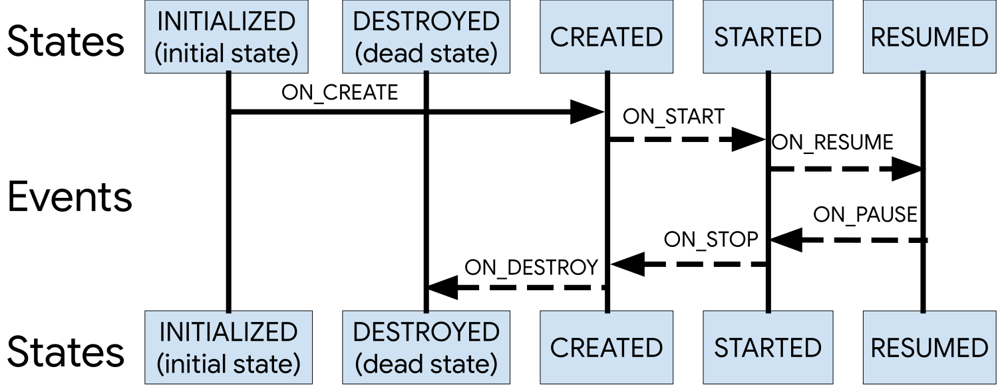
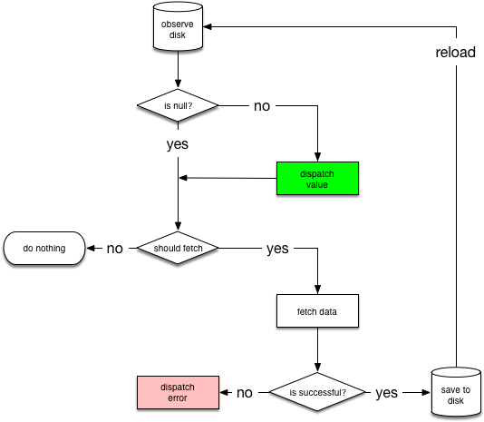

## Activity
### 1.生命周期
onCreate 创建  
onStart 启动  
onResume 可见  
onPause 失去焦点   
onStop 不可见   
onDestroy 销毁

	a.默认Dialog对activity的生命周期没有影响。如果一个Theme为Dialog的Activity弹出，则生命周期应该为：
	A.onPause -> B.onCreate ->   -> B.onResume;
	b.当activity A打开Activity B时 首先Activity A  onPause  然后Activity B onCreate onStart onResume 然后 Activity A onStop；
	如果B的launchMode为singleTask或者是singleInstance,并且栈中都有可以复用的Activity，那么经过的生命周期应该为：
	A.onPause -> B.onNewIntent -> B.onRestart -> B.onStart -> B.onResume -> A.onStop; 
	c.切换屏幕默认情况：Activity 会销毁重建 。当配置configChange=‘orientation’ 时则不会销毁重建，但会调用onConfigChange 方法。
	d. A activity 打开 A activity时 生命周期变化与lauch mode 相关，默认standard 不复用，重新创建参照 b。如果其他则会复用 所以是 onPause onNewintent （获取新的参数）onResume。
	e. app进程在后台被被GC回收时 不会执行onDestroy。抛出异常 crash 时后续什么周期都不会执行。
	f. 按下Home/menu健 onPause onStop onSaveInstanceState 通过menu杀死onDestroy

### 2. Launch Mode

* 	standard  标准模式  每次开启都会创建实例，不复用。
* 	singleTop 栈顶复用，会调用onNewIntent方法。pause -> restart
* 	singleTask 在任务栈中只能有一个实例，当存在时再被打开时在其上的Activity 全部销毁，而它就会处在栈顶调用onNewIntent
* 	singleInstance 单例模式 唯一实例独享任务栈 重复启动复用，调用onNewIntent

除Launch Mode外在intent中添加Flag可以更灵活的操作Activity行为：

| Flags 		| 意义及使用
|:-------------|:-------------|
|Intent.FLAG_ACTIVITY_BROUGHT_TO_FRONT| 前置|
|	Intent.FLAG_ACTIVITY_CLEAR_TASK, |【 本flag能造成在新活动启动前，与新活动关联的任务被清空。也就是说，新活动成为新任务的根，旧的活动都被结束了。本flag只能与FLAG_ACTIVITY_NEW_TASK联合使用。】|
|	Intent.FLAG_ACTIVITY_CLEAR_TOP, | 相当于 singleTop|
|	Intent.FLAG_ACTIVITY_CLEAR_WHEN_TASK_RESET,||
|	Intent.FLAG_ACTIVITY_EXCLUDE_FROM_RECENTS,||
|	Intent.FLAG_ACTIVITY_FORWARD_RESULT,||
|	Intent.FLAG_ACTIVITY_LAUNCHED_FROM_HISTORY,||
|	Intent.FLAG_ACTIVITY_LAUNCH_ADJACENT,||
|	Intent.FLAG_ACTIVITY_MULTIPLE_TASK,||
|	Intent.FLAG_ACTIVITY_NEW_DOCUMENT,||
|	Intent.FLAG_ACTIVITY_NEW_TASK,||
|	Intent.FLAG_ACTIVITY_NO_ANIMATION,||
|	Intent.FLAG_ACTIVITY_NO_HISTORY,|【1. 新活动不会保留在历史栈中，一旦用户切换到其他页面，新活动会马上销毁。2. 旧活动的onActivityResult()方法永远不会被触发。】|
|	Intent.FLAG_ACTIVITY_NO_USER_ACTION,||
|	Intent.FLAG_ACTIVITY_PREVIOUS_IS_TOP,||
|	Intent.FLAG_ACTIVITY_REORDER_TO_FRONT,||
|	Intent.FLAG_ACTIVITY_RESET_TASK_IF_NEEDED,||
|	Intent.FLAG_ACTIVITY_RETAIN_IN_RECENTS,||
|	Intent.FLAG_ACTIVITY_SINGLE_TOP|【 新活动已存在历史栈的顶端时就不会重新启动。】|
|	Intent.FLAG_ACTIVITY_TASK_ON_HOME,||

### 转场动画设置
1.theme 中 设置

	<item name="android:activityOpenEnterAnimation">@anim/slide_in</item>
    <item name="android:activityCloseEnterAnimation">@anim/slide_in</item>
    <item name="android:activityOpenExitAnimation">@anim/slide_out</item>
    <item name="android:activityCloseExitAnimation">@anim/slide_out</item>

2.覆写 Activity 的`public void overridePendingTransition(int enterAnim, int exitAnim) `方法
enterAnim和exitAnim分别为该Activity进出场动画的ResInt。在res.anim目录下enterAnim.xml

## Fragment
###  生命周期 ：
构造函数创建Fragment对象。FragmentManager.begin

* onAttach 当Fragment添加到Activity中时。
* onCreate 
* onCreateView 
* onViewCreated 
* onActivityCreated 
* onStart onResume
* onPause 
* onStop 
* onDestroyView
* onDestroy
* onDetach

###  在ViewPager中生命周期
首先viewpager  的pages will be kept offscreen in an idle state.默认值limit = 1，则表示默认会左右（最边上的只有一个）各保存闲置状态下的一个Page 。其余的page会销毁。
当启动时第一次创建ViewPager设置Adapter时会创建两Fragment  
A onAttach-onCreate    B  onAttach-onCreate 
A  onCreateView - onViewCreated - onStart - onCreateAnimation - onCreateAnimator
B  onCreateView - onViewCreated - onStart - onCreateAnimation - onCreateAnimator
A onResume 
滑动一次
C onAttach-onCreate - onViewCreated - onStart - onCreateAnimation - onCreateAnimator
A  onPause 
B onResume  
再滑动一次
A  onStop - onDestroyView -  onCreateAnimation - onCreateAnimator
B  onPause 
C onResume 
viewpager.setOffscreenPageLimit(int limit) 来设置缓存多少个Page最多2*limit +1 page。

viewPager adapter的notifydataChanged方法调用需要 实现 getItemPosition 方法
## Context
### 1. context继承关系
> Context 抽象类 上下文主要用于获取资源 SP Resource Assets Intent PackageManager ContentResolver
> >ContextIml  所有功能的实现都在这里
> 
> >ContextWrapper 外观设计模式，内部都包含一个ContextIml mBase
> > >
> > >  Service
> > > 
> > >  Application
> > >
> > >  ContextThemeWrapper
> > > > Activity

### getApplication()和 getApplicationContext()
是同一个对象 Application在进程中只有一个实例它本身就是Context ，所以getApplicationContext()所得到的 也可以是Application对象。只不过getApplication是在Activity和Service中才有。getApplicationContext 是 Context的方法；Activity getApplication attach的时候传入的。

### 正确使用Context
Context 使用导致内存泄漏。静态资源持有Activity，Handler
1：当Application的Context能搞定的情况下，并且生命周期长的对象，优先使用Application的Context。
2：不要让生命周期长于Activity的对象持有到Activity的引用。
3：尽量不要在Activity中使用非静态内部类，因为非静态内部类会隐式持有外部类实例的引用（Handler）
如果使用静态内部类，将外部实例引用作为弱引用持有。

## Srvice
### 启动服务的两种方式和相应的生命周期
1. **start:**  context.startService()		onCreate->onStartCommond->onDestroy
2. **bind:**  context.bindService()		onCreate->onBind->onUnbind->onDestroy

### onRebind什么情况下会被调用？
onUnbind 返回true，所有的绑定都解绑后再次绑定时会执行！

### 服务优先级的提升（保活）
1. Manifest中intentFilter 中 priority 值越大优先越高。
2. onStartCommond 中 startForeground 与通知绑定提升为为前台服务
3. onStartCommond中返回 START_STICKY_COMPATIBILITY 或 START_STICKY成为粘性服务，被系统回收时会尝试重启。
4. 设置守护进程，通过IPC保活。
5. 

### IntentSrvice 
onHandleIntent 在子线程中执行，执行完后自动销毁。实现原理HandlerThread。


## BroadCast 
可用于IPC 实现原理binder。
### 广播接收者注册 
context.registerReceiver(receiver,filter)
### 广播的发送     
sendBroadcast(intent);
sendOrderedBroadcast(intent,"");
### 广播的类型
1. 注册方式：静态注册（manifest中注册）和动态注册（代码）
2. 接收方式：**有序广播**和**无序广播** 有序广播 按优先级 接收并且可以决定是否继续传递下去。无序广播按注册顺序发送。

### 广播拦截（有序广播）
abortBroadcast();

### 广播的接收
* 除了action 和 intentfilter ，可以通过权限来控制接受者的范围。
* AMS广播队列有两个mFgBroadcastQueue和mBgBroadcastQueue 根据intent的Flag过设置FLAG_RECEIVER_FOREGROUND来决定
* 前台广播队列的超时时间比后台广播队列短很多
* 后台广播队列在当前用户后台启动服务超过阈值时会暂停广播
* 前台广播允许接收者以前台优先级运行
### 本地广播的使用
	
    LocalBroadcastManager instance = LocalBroadcastManager.getInstance(this); //获取帮助类
    instance.sendBroadcast(intent); // 发送广播
    filter.addAction("");
    instance.registerReceiver(receiver, filter); // 注册接收者
    instance.unregisterReceiver(receiver); // 取消注册
    
本地广播不会垮进程进程传递数据，所以更安全高效，只在当前进程中可以接收广播。

## ContentProvider

*  ContentProviders 负责管理结构化数据的访问，封装数据并且提供一套定义数据安全的机制。
*  ContentObserver 对数据（数据采用uri描述）进行监听，当监听到数据变化通知时，系统就会调用ContentObserver的onChange()方法
*  ContentResolver 调用getContentResolver().notifyChange(uri, null)来通知注册在此URI上的访问者

### ContentProvider的使用
1. 提供数据进程创建：继承ContentProvider ，实现其方法包括onCreate 和 增删改查，在Manifest中注册。

	``` 		
	android:permission="app.permission.USE_TEST_PROVIDER" // 指定使用权限
	android:authorities="com.xxx.xxx"// Uri/name 连接的Uri
	``` 
2. 数据使用进程：context.getContentResolver 得到ContentResolver 对象。
3. ContentResolver.acquireContentProviderClient(Uri/name)得到ContentProviderClient对象。client可直操作数据。
	```
	Uri uri = Uri.parse("content://com.xxx.xxx/table_name"); 
	client.
	```
4. 通过ContentResolver.registerContentObserver(ContentObserver) 来注册观察者监听数据变化。
5. ContentProviderClient.release() /ContentResolver.unregisterContentObserver(observer); 释放资源


### AndroidManifest.xml
1. permission 与 uses-permission的区别 
服务端 ：通过permission 自定义权限，组件通过 `android:permission` 来制定所需的权限 export=true 对外暴露。
客服端 ：通过uses-permission 声明使用权限（包括系统权限）。然后调用暴露的组件。
2. 权限级别：
	* 	normal  表示权限是低风险的，不会对系统、用户或其他应用程序造成危害；
	* 	dangerous  表示权限是高风险的，系统将可能要求用户输入相关信息，才会授予此权限；
	* 	signature  表示只有当应用程序所用数字签名与声明引权限的应用程序所用数字签名相同时，才能将权限授给它；


##数据库
### SQLite
一般写数据库都是操作一个继承至 SQLiteOpenHelper 的类

1. 然后我们需要实现它的构造方法

    public MyDatabaseOpenHelper(Context context) {
        super(context//上下文对象, DB_NAME//数据库名称, null, version//版本号);
    }
2. 然后我们需要注意的是一个方法 public void onCreate(SQLiteDatabase db) 这个方法是在数据库不存在的时候被调用的,当然这个"不存在"是系统帮助我们来寻找的在这个方法里面我们可以创建当前版本必须要的表,或者表对应的数据。

3. 然后还有两个回调函数,也需要注意的,因为它们关联着我们要说的升级与降级

	1. 升级操作 public void onUpgrade(SQLiteDatabase db, int oldVersion, int newVersion)
	在这里做升级的操作,也就是说,当你改变数据库的　version的时候,系统会自动判断,你当前的版本是高于,还是低于你要创建的版本。当然这里是低于!!!

		升级的具体思路就是,只添加字段,不做其他操作.因为,你升级以后还是需要用到老版本的一些属性,所有说,这样说有很大的好处,
然后就是当数据库不存在时,也需要创建对应版本的数据库
	2. 降级操作 public void onDowngrade(SQLiteDatabase db, int oldVersion, int newVersion)
大概步骤就是
	
	1. 备份当前版本数据库表　　主要是为了后面的copy
	2. 修改当前数据库表名　　　主要是为了降级的表名称
	3. 创建降级版本数据库表,并将当前数据copy到降级表中　　　　主要是为了提高用户黏度
	4. 删除备份表　　　　　　　主要是为了下次降级不会建表冲突
	然后就是一个很重要的操作了,那就是,如果当你降级不成功怎么办?
	我们的解决方案也很简单,那就是加一个try/catch() 来捕获这个异常,然后创建对应表的数据结构
> 	SQLite ALTER 不支持 删除列的操作 只能 ADD和RENAME 
> 
>  SQL: 
> DML:数据修改语言 数据的 增 删 改 查
> 
> 增： insert into TAB_NAME  (column_1, column_2, column_3,...) VALUES (value_1, value_2, value_3, ...);
> 删：delete from TAB_NAME where id = 'id...'; 
> 清空表：truncate table TAB_NAME；// 不会记录每一条删除的记录 比 delete * 要高效。
> 改：update TAB_NAME set column1=value1,column2=value2,... where some_column=some_value;
> 查：SELECT column_name,column_name FROM table_name;
> 	   SELECT * FROM table_name;
> 	   SELECT DISTINCT column_name,column_name FROM table_name;
> 连表查询：
> INNER JOIN：如果表中有至少一个匹配，则返回行
> LEFT JOIN：即使右表中没有匹配，也从左表返回所有的行
> RIGHT JOIN：即使左表中没有匹配，也从右表返回所有的行
> FULL JOIN：只要其中一个表中存在匹配，则返回行
> 
> DDL:数据定义语言 表的创建 修改 删除
>创建   CREATE TABLE table_name
	(
	column_name1 data_type(size),
	column_name2 data_type(size),
	column_name3 data_type(size),
	....
	);
	DROP TABLE table_name；
ALTER TABLE table_name 
     	ADD column_name datatype   添加字段
	MODIFY COLUMN column_name datatype 修改字段
	DROP COLUMN column_name 删除字段 SQL 不支持删除字段


### Room
使用Room的时候，如果你改变了数据库的schema但是没有更新version，app将会crash。
而如果你更新了version但是没有提供迁移，数据库的表就会drop掉，用户将丢失数据。
具体升级方式：

1. 创建Migration

	```
 	Migration migration = new Migration([startVersion], [oldVersion],){
        @Override
        public void migrate(@NonNull SupportSQLiteDatabase database) { 
        // 迁移时的操作
            String sql = "XXXXXX"; // 迁移要执行的SQL。
            database.execSQL(sql);
        }
    };
    ```
2. 添加Migration

	```
 	Room.databaseBuilder(context.getApplicationContext(),
                            AppDatabase.class, "KingApp_DB")
                            .addMigrations(migration) // 添加版本迁移的操作。
                            .addCallback(sRoomDatabaseCallback)
                            .build();
    ```
3. 数据库迁移完成还想数据修改或别的操作再sRoomDatabaseCallback中处理：

	```
 	private static RoomDatabase.Callback sRoomDatabaseCallback = new RoomDatabase.Callback() {
        @Override
        public void onOpen(@NonNull SupportSQLiteDatabase db) {
            super.onOpen(db);
           // 连接数据库
        }
        @Override
        public void onCreate(@NonNull SupportSQLiteDatabase db) {
            super.onCreate(db); //默认创建数据库 还可以做额外的事
            // 创建数据库
        }

        @Override
        public void onDestructiveMigration(@NonNull SupportSQLiteDatabase db) {
            super.onDestructiveMigration(db);
            int version = db.getVersion();
            // 修改已有的库 （升级）
        }
    };
    ```


##SharedPreference 
### 原理及性能问题 
内存 中是HashMap， 磁盘中是XML
### apply与commit
commit 是同步操作直到写入磁盘，会有boolean结果，applay 是存入Map中发起写入磁盘之后就返回。
### 线程安全性安全性问题，垮进程如何解决。
线程不安全，解决实现 SharedPreferences 加同步锁。或者封装自己的SP工具类 实现同步。
垮进程也不安全，无法解决？通过binder IPC 。选择一个进程中维护SP在其他进程通过IPC记者读写。

替代方案：腾讯 MMKV 序列化方式 protobuf 保证效率， 多进程共享mmap 信号量来保证跨进程操作的安全性。

## ANR
###1.是什么导致了ANR？
在Android中，程序的响应性是由ActivityManager与WindowManager系统服务来负责监控的。
当系统监测到下面的条件之一时会显示ANR的对话框：

1. 对输入事件(例如硬件点击或者屏幕触摸事件)，5秒内都无响应。
2. BroadReceiver不能够在10秒内结束接收到任务（onReceive方法执行时长，前台10s 后台60s）。
3. Service 前台20s后台200s未完成启动
4. ContentProvider的publish在10s内没进行完：

对于你的应用中任何可能长时间执行的操作，你都不应该执行在UI线程。
根本原因

* 1:主线程频繁进行耗时的IO操作：如数据库读写
* 2:多线程操作的死锁，主线程被block；
* 3:主线程被Binder对端block；
* 4:System Server中WatchDog出现ANR；
* 5:service binder的连接达到上线无法和和System Server通信
* 6:系统资源已耗尽（管道、CPU、IO）


###2.如何避免ANRs？
1. 对于你的应用中任何可能长时间执行的操作，你都不应该执行在UI线程。
如网络请求，文件I/O，复杂的计算等。应放在工作线程中执行。
2. 创建自己的线程或者HandlerThread稍微复杂一点。如果你想这样做，你应该通过Process.setThreadPriority()
并传递THREAD_PRIORITY_BACKGROUND来设置线程的优先级为"background"。如果你不通过这个方式来给线程设置一个低
的优先级，那么这个线程仍然会使得你的应用显得卡顿，因为这个线程默认与UI线程有着同样的优先级。
3. 不阻塞UI线程来等待工作线程的结果，通过UI线程创建Handler提供给工作线程来，来监听并响应工作线程。
4. BroadcastReceiver有特定执行时间的限制说明了broadcast receivers应该做的是：简短快速的任务，避免执行费时
的操作，例如保存数据或者注册一个Notification。正如在UI线程中执行的方法一样，程序应该避免在broadcast receiver
中执行费时的长任务。但不是采用通过工作线程来执行复杂的任务的方式，你的程序应该启动一个IntentService来响应intent
 broadcast的长时间任务。

###3.增加响应性
通常来说，100ms - 200ms是用户能够察觉到卡顿的上限。这样的话，下面有一些避免ANR的技巧：

* 如果你的程序需要响应正在后台加载的任务，在你的UI中可以显示ProgressBar来显示进度。
* 对游戏程序，在工作线程执行计算的任务。
* 如果你的程序在启动阶段有一个耗时的初始化操作，可以考虑显示一个闪屏，要么尽快的显示主界面，然后马上显示一个加载的
对话框，异步加载数据。无论哪种情况，你都应该显示一个进度信息，以免用户感觉程序有卡顿的情况。
* 使用性能测试工具，例如 Systrace 与 Traceview来判断程序中影响响应性的瓶颈。

### ANR的定位
日志保存在trace文件保存到了/data/anr/traces.txt，
获取 
adb pull /data/anr/traces.txt
adb bugreport ./bugreport.zip (anr_2020_2_21_xxx  android 10)

日志解析：

定位：am_anr 
ANR时间：07-20 15:36:36.472
进程pid：1480
进程名：com.xxxx.moblie
ANR类型：KeyDispatchTimeout
CUP的使用率。


##Android消息机制
	
	ActivityThread.java
    --------------------------------------------------------------
        public static void main(String[] args) {
        ...
            Looper.prepareMainLooper();
            ...
            ActivityThread thread = new ActivityThread();
            thread.attach(false, startSeq);
   
            if (sMainThreadHandler == null) {
                sMainThreadHandler = thread.getHandler();
            }
            ...
            Looper.loop();
            throw new RuntimeException("Main thread loop unexpectedly exited");
        }
        
### Looper 
构造函数私有 通过静态方法 prepare() 来为当前线程创建实例。 
线程唯一 保存在 ThreadLocal 用来保存线程私有的数据 getMap(curThread)得到ThreadLocalMap.getEntry(ThreadLocal) 的Looper。静态方法loop 先检查当前线程是否存在Looper 存在则for (;;)开启无线循环，从MessageQueue中取消息调用 msg.target.dispatchMessage(msg);处理消息 Message msg.target就是发送他的 handler

	 Looper mainLooper = Looper.getMainLooper();
    Looper.myQueue().addIdleHandler(() -> { // 监听MessageQueue 来检测UI线程是否空闲。
        print("Looper.myQueue onIdle");
        return false;
    });
    Printer printer = x -> print(x);
    mainLooper.setMessageLogging(printer);// 监听FrameHandler 来检查UI 卡顿。
    
### ThreadLocal 

在通过Thread 拿到ThreadLocal对象 （ThreadLocalMap 是ThreadLocal静态内部类），
每个Thread都有自己的ThreadLocalMap threadLocals 是一种hash表。ThreadLocal对象作为Key存储对象。


### MessageQueue
Looper在创建时就会在构造函数中创建 mQueue = new MessageQueue(quitAllowed)；
queue.enqueueMessage(msg, uptimeMillis) 对消息进行排序插入消息队列（ messageQueue 是链表结构，message.when排序）
MessageQueue中有几个native方法

    private native static long nativeInit();  在java的MessageQueue创建时C++同时也会创建消息队列
    private native static void nativeDestroy(long ptr);销毁消息队列
    private native void nativePollOnce(long ptr, int timeoutMillis); /*non-static for callbacks*/ epull机制唤醒C++层的looper 来读取消息
    private native static void nativeWake(long ptr);
    private native static boolean nativeIsPolling(long ptr);
    private native static void nativeSetFileDescriptorEvents(long ptr, int fd, int events);
    
### epoll机制
Linux 的I/O 多路复用机制。全名event poll，同时管理大量的文件描述符。

1. **epoll_create 创建epoll对象。**
1. **epoll_ctl 将文件描述符的事件注册到epoll中。**参数包括 文件描述符fd（检测对象）op（操作类型 增删改） epoll_event(事件详情)
1. **epoll_await 等待事件的到来**

> epoll_event 包含 事件类型 EPOLLIN/EPOLLOUT/EPOLLERR/EPOLLHUP  和 event_data

### Handler 
负责发送消息（sendXXX Message 和post Runnable 最终被封装成Message 的.callBack）和并在创建的线程处理消息处理消息（onHandlerMessage）
所有发送消息最终调用 enqueueMessage --> msg.target = this
在调用 MessageQueue.enqueueMessage(msg, uptimeMillis)
消息处理 

    public void dispatchMessage(Message msg) {
        if (msg.callback != null) { // 
            handleCallback(msg);
        } else {
            if (mCallback != null) { // 创建handler时会创建 或者设置 
                if (mCallback.handleMessage(msg)) {
                    return;
                }
            }
            handleMessage(msg); // 最后才执行
        }
    }
    
    
## OOM
OutOfMemoryError 内存溢出。DVM/ART 内存分配机制，对每个进程都设置了heapsize 当应用使用内存超过时就会发生OOM
造成OOM 的原因有，一次性申请的内存过大超出可用内存，二 内存泄漏导致内存资源逐渐耗尽。
对于第一种情况下是
大图图片加载  因为一部手机屏幕的大小分辨率是确定的 所以我们所需要显示的内容必要大小也是固定的，加载时应该根据实际情况设置取样率 和 取样范围来部分加载 图片资源避免OOM。对于可能有OOM的地方进行TryCatch 然后调整取样率来解决，或者用Weak/SoftRefence来避免OOM 导致的crash。大文件的加载（MD5校验 读取文件缓存区域过大）。
对于内存泄漏 通过工具排查 Leak Canery集成到项目中，还有通过AS自带工具Profile中内存分析工具 来排查具体的泄漏位置。
常见的泄漏 IO Socket Cursor 等及时为关闭。 或则Activity/Fragment View等泄漏 Context。一般都是编码bug 导致的。找到以后更正。Native内存泄漏 不太懂不瞎说了。
    
## View
> View做为构建视图的基本单元，总是在屏幕上占据矩形区域，承担视图绘制和事件的处理。所有view以一颗树的形式被安排在Window内。view分为两大类一类是viewgroup 负责组织和放置view，他们一般是不可见的，另一类就是view可见的如文本，图片，按钮等。在窗口中展示view所占据 的位置由位置和形状决定。

### View层级
>  Activity -> Window(PhoneWindow 初始化DV 及其他SysUI) ->  WindowManager(WindowMangerImpl 持有Window对象) -> WindowMangerGlobal（代替WM行使管理职能，向窗口中添加和移除view，View/布局参数/ViewRootImol-->mViews mParams mRoots） -> ViewRootImpl(触发测量摆放及绘制 和 接收事件并转发，并和WMS通讯，协调窗口，传递窗口信息 )-> DecorView （View树的根节点，内部会包含系统UI）

### View的绘制流程 
> 由ViewRootImpl发起  preformTraversals（）

1. 预测量 走完整测量流程，计算需要窗口的尺寸
	1. measureHieracy()
2. 窗口布局，与WMS通讯，协商调整窗口尺寸
3. 测量 measure 父控件为子空间提供约束，子控件在onMeasure中，根据MeasureSpec完成测量。递归从上至下传递约束，测量结果至下而上传递，父控件根据子控件测量结果，最终确定，自身尺寸，最终窗口约束框架下完成测量。
4. 	摆放 layout 根据测量的尺寸从上至下递归逐层确定自控在父控件中的上下左右的值。 
5. 绘制 draw 绘制过程分为多种情况：
	*  软件绘制drawSoftware()
		1. 通过Surface.lockCanvas()获取到一个绘制的Canvas
		2. 对Canvas进行变换实现滚动效果
		3. 通过mView.draw(Canvas)绘制view树。
			1. 绘制背景，不受滚动的影响
			2. 执行onDraw()绘制自身内容
			3. 执行ViewGroup.dispatchDraw()绘制子view
				1. canvas.save()保存状态，canvas.clipRect()锁定绘制区域。
				2. 确定子控件的绘制顺序 ,默认按添加顺序绘制，通过setChildrenDrawingOrderEnable(true)；覆写getChildDrawingOrder()。来指定自控家的绘制顺序。这一点对于重叠子控件的绘制至关重要。
				3. 遍历children 对需要绘制的执行 rawChild(canvas，child，time动画时间)
				4. 调用子控件的View.draw(ViewGroup，Canvas，time)
					1. 变换坐标系，包括子控件在父控件中位置，动画等
					2. 变换后的Canvas 绘制子控件
			4. 绘制空件装饰，即滚动条。
		4. 通过Surface.unlockCanvasAndPost() 显示绘制内容。
	*  硬件绘制
	*  软件缓存绘制
	*  硬件缓存绘制
6. 使用canvas 或 hardwareCanvas先绘制不透明的背景，同onDraw在绘制view内容。通过dispatchDraw绘制子控件，逐层绘制，在绘制装饰（滚动条）。 
子控件的绘制顺序默认按添加顺序绘制，最后绘制全部可见。改变绘制顺序需覆写getChildrenDrawingOrder 来定制绘制顺序。同时也会影响触摸事件的分发。

### ViewRootImp
#### 成员

1. ViewRootHandler **mHandler** IPC 过程中从binder线程 切到UI
2. Choreographer **mChoreographer** 通过VSYNC事件，触发重绘视图的操作，协调动画、输入和绘图的时间安排。
2. Surface **mSurface**  WMS通过relayoutWIndow为其分配一块Surface
3. mWinFrame /mPendingContentInset/mPendingVisibleInset WMS会将最新 的窗口信息同步到这三个变量中。
3. **mHeight/mWidth** 窗口经过重新布局后与WMS达成一致的窗口尺寸
4. mView -> DecorView
5. mInputChannel 对接InputDispatcher的管道
6. mInputEventReceiver 用于接收输入事件
7. **RunQueue** View.post/postDelay 从attachInfo中获取ViewRootImpl的成员mHandler 执行Runnable 然而当View没有attcah 时attachInfo为空。post 的runnable会被添加到RunQueue中。ViewRootImpl在吧RunQueue中的Runnable 发送给mHandler。

#### 生命周期
构造函数-> setView->addView->...->die


### 事件输入途径对象。 
  设备节点 -> EventHub ->  InputEventReader -> InputDispatcher -> InputChannel ->  InputEventReciever ->  ViewRootImpl -> DecorView -> Activity ->  Window ->  DecorView ->  ViewGroup -> View
### 事件来源
> android 输入事件 通过内核写入/dev/input/目录下相应的设备节点中，IMS通过INotify 和 epoll机制监听并读取如数事件将其翻译 并包装成KeyEvent/MotionEvent 通过WMS 分发给Window，
再通过ViewRootImpl分发给View。
InputEventReciever（InputChannel ，Looper）// 事件接收 receiver.onInputEvent（）QueueInputEvent 

### Touch事件分发 
----------------------------------
	mView --> dispatchPointerEvent()
	mView --> dispatchPointerEvent(MothionEvent)


---------------------------------- 
完整事件序列包含： MotionEvent_Down/MotionEvent_Pointer_Down/MotionEvent_Move/MotionEvent_Pointer_Up/MotionEvent_Up。MotionEvent_Down来寻找事件接收的目标，控件一旦接受Down事件，同一序列的其他事件也有该控件接受。触摸事件根据位置传递。一个事件中包含了触摸的位置。只有处在该位置上的控件才有资格消费事件。
  


### 动画 
控件的动画有三种：
#### ValueAnimator/ ObjectAnimator/ViewPropirtyAnimator 属性动画。
ValueAnimator内部实现了一个Runnable接口线程，唯一的AnimationHandler类，开启动画时ValueAnimator不断底将AnimationHandler抛给Choreographer，并在VSYNC信号到来时，修改指定的属性，从而引起View的invalidate()来绘制更新。
#### LayoutTransition 类 使用ObjectAnimator来实现ViewGroup中删除和添加子view的动画
#### View.startAnimation 开启动画。

<!--Animation 包含四类动画 平移 缩放 旋转 和透明度 
描述一个动画过程，起、止状态，时长，延时，变化速率。
Transformation 类描述了一个变换 主要包含：透明度和一个二维矩阵变换
Choreographer 对动画逐帧渲染 postCallback-->


###11. WMS


###12.RecyclerView
#### 12.1 RecyclerView （androidx.recyclerview.widget）
继承 ViewGroup 实现了ScrollingView, NestedScrollingChild2, NestedScrollingChild3等接口

Adapter ：{Adapter}的子类负责提供表示数据集中项的视图
Position：数据项在适配器内的位置.
Index：在调用{getChildAt}时使用的附加子视图的索引
Binding：准备子视图以显示与适配器中位置对应的数据的过程。
Recycle（view）：以前用于显示特定适配器的数据的视图位置可放置在缓存中，以便稍后重用，这可以跳过初始和布局构建，
            从而极大地提高性能
            回收者负责管理废弃的或分离的项目视图，以便重用。一个“废弃的”视图是一个仍然附加到它的父视图的视图，
            但是已经被标记为删除或重用。{@link LayoutManager}回收器的典型用途是获取表示给定位置或项目ID的数
            据的适配器数据集的视图。如果要重用的视图被认为是“脏的”，适配器将被要求重新绑定它。如果没有，
            LayoutManager可以快速重用视图，而不需要做进一步的工作。

            没有请求布局{@link android.view.View#islayoutrequest () is false}的干净视图可以被
            LayoutManager重新定位而不需要重新测量

Scrap（view）：在布局期间进入临时分离状态的子视图。废弃视图可以在不完全脱离父类RecyclerView的情况下被重用，如果
            不需要重新绑定，可以不修改;如果视图被认为是脏的，可以由适配器修改
Dirty（view）：一个子视图，在显示之前必须由适配器rebound


RecyclerView在{@link Adapter}和{@link LayoutManager}之间引入了额外的抽象级别，以便能够在布局计算期间检测批
处理中的数据集更改。这使LayoutManager不必跟踪适配器更改来计算动画。它还有助于提高性能，因为所有视图绑定同时发生，
避免了不必要的绑定。
因此，在RecyclerView中有两种position相关方法:
布局位置:Item在最新布局计算中的位置。这是 从布置图经理的角度来看职位
适配器位置:一个Item在适配器中的位置。这是我们的位置 适配器的透视图。
除了调度adapter.notify*事件并计算更新后的布局的时间外，这两个位置是相同的。

LayoutManger
ViewHoldersDiffUtil

优化：
1.设置全局的 RecycledViewPool
2.setViewCacheExtension 给指定的位置返回固定视图。
3.Adapter 采用listAdapter 传入DiffUtil.ItemCallback。根据不同的数据作ItemCallback实现，减少不必要的刷新。
4.数据预加载()。


##Android性能优化
### 开发阶段：
### [严格模式StrictMode](https://www.cnblogs.com/yaowen/p/6024690.html)

debug模式下开启严格模式，检测主线程中耗时操作，IO ，网络，或自定义的耗时方法调用，以及closable的使用防止遗忘关闭，数据 以及activity的泄漏等可以弹窗提示，日志等。

### 启动时长优化
首先要统计启动项的耗时情况。
找到具体耗时的方法。（Debug.startMethodTracing([Path])/Debug.stopMethodTracing()）在指定路径下生成.trace文件。
将其拖到AS中打开会看到，方法调用及耗时及线程情况。通过此文件可以查出耗时规律。
可以采用异步启动，或延时启动等策略来加快启动的事件。
视觉的优化 通过设置窗口背景图来给 以及闪屏来等待启动完成。掩饰在mainactivity中的启动耗时。

####1. 绘制优化
android UI的绘制的帧率60FPS时，人眼才不会感觉卡顿，Android的垂直同步信号每16ms同步一次Surface给SurfaceFlinger 去输出到屏幕，否者就要等到下一次信号才能在进行同步，就会出现丢帧现象，人眼感觉卡顿。所以绘制优化的目的就是要确保16ms完成控制树的绘制。
造成卡顿的原因较多：
1.布局过于复杂，在16ms无法完成绘制。
优化：简化布局尽量减少控件树的深度，避免过度绘制，譬如背景色尽量不去设置，对于绘制层叠较深的可用自定义控件，将其扁平化。尽量给布局确定的尺寸，减少测量耗时。使用硬件加速，合理设置绘制缓存提高绘制效率。
只需重新绘制时 invalidate 和 需要重新布局时 requestLayout 调用时。
2.布局的耗时主要IO 及XML的解析反射创建对象，这一过程比较耗时，可以在编译时，将XML文件转换成代码 例如X2C 框架，可以加速ViewTree的构建。
2.合理使用动画，动画是双刃剑利用不好就会好资源的卡顿，用的好可以给人视觉的舒适感，合理引导用户。
3.内存抖动引发GC，导致暂停等待GC（在内存优化中再说）。


####2. 内存优化
避免内存泄漏：
生命短的对象被生命周期长的对象应用，无法及时释放。解决办法利用软应用/弱引用避免，内部类对象持有外部类的对象引用，例如Handler引起Activity内存泄漏，可用静态内部来代替。这样内部里就不不在持有外部类应用了。
静态对象谨慎使用。永久代难以回收。
软引用/弱引用
图片加载，控件尺寸来取样，采用相对较小图片格式。
####3. 运行效率提升
网络优化：

* 直接使用IP可以减掉域名解析时间。
* 共用链接池减少建立连接的事件。
* 利用缓存响应可以节省流量，也可以提升速度。
* 静态资源用CDN服务器提高稳定性响应速度。
* 设置优先级数据接口优先，图片次之，文件下载最低，日志空闲时上报。优先保证数据接口完成请求。
* 图片按需加载，按设备的分辨率；

高效的算法和高效的API：

* 文件的读写使用带缓存区的API 或者NIO
* 比如json数据的解析 FastJson更快。
* 选择合理的数据结 构如：ArrayList 查询块，LinkList 增删速度快。

预加载和缓存：

* 用空间换时间。比如数据，图片预加载缓存，

使用线程池，避免线程频繁创建与销毁带来的开销。
延时初始化，提高启动速度。
后台任务合理安排
通过视觉过度提升用户体验

减少内存抖动

及时释放闲置资源 IO，关Curser，Bitmap 的回收

提高运行效率，
Lint 代码检测。
内存泄漏检测 LeakCannery 

AS 
Profile 检测内存泄漏 及 内存分析。
Layout Inspector 查看布局层级。以DecorView 为根的树

MAT
#### 打包发布：
1.移除无用资源和代码
2.代码混淆压缩
3.资源压缩
4.dex优化
#### 线上运行阶段实时性能监测：
完善的日志上报系统，app运行的堆栈信息，包括Crash/ANR/UI卡顿检测/启动时长。性能监控系统对应用的运行影响要降到最低。日志上报的实际，可利用系统闲暇时间上报，MessageQueue.IdleHandler来检测主线程闲置与否，错峰上报。


adb shell procrank //  获取进程排名
```
ZRAM: 0K physical used for 2098368K in swap (2293756K total swap)
 RAM: 5802228K total, 108292K free, 2832K buffers, 1366468K cached, 25088K shmem, 499532K slab
 ```
adb shell getprop | grep dalvik.vm.heapsize //  堆内存的阀值

```
[dalvik.vm.heapsize]: [512m]
```
adb shell cat /proc/meminfo //  查看内存使用情况

```
MemTotal:        5802228 kB
MemFree:          251900 kB
MemAvailable:    1397228 kB
Buffers:            3172 kB
Cached:          1318956 kB
SwapCached:        37904 kB
Active:          1684568 kB
Inactive:        1291444 kB
Active(anon):    1248908 kB
Inactive(anon):   549640 kB
Active(file):     435660 kB
Inactive(file):   741804 kB
Unevictable:      125944 kB
Mlocked:          125944 kB
SwapTotal:       2293756 kB
SwapFree:          14424 kB
Dirty:                48 kB
Writeback:             0 kB
AnonPages:       1772316 kB
Mapped:           604404 kB
Shmem:             23756 kB
Slab:             500024 kB
SReclaimable:     196152 kB
SUnreclaim:       303872 kB
KernelStack:      104544 kB
PageTables:       151064 kB
NFS_Unstable:          0 kB
Bounce:                0 kB
WritebackTmp:          0 kB
CommitLimit:     5194868 kB
Committed_AS:   151558136 kB
VmallocTotal:   263061440 kB
VmallocUsed:           0 kB
VmallocChunk:          0 kB
CmaTotal:        1024000 kB
CmaFree:           51468 kB
IonTotalCache:      2176 kB
IonTotalUsed:     200188 kB
RsvTotalUsed:     296452 kB
```
adb shell dumpsys meminfo [ packagename/pid] //查看进程的内存信息

#### 应用程序如何绕过dalvikvm heapsize的限制?
1. 创建子进程,使用android:process标签
2. 使用jni在native heap上申请空间（推荐使用）
3. 使用显存（操作系统预留RAM的一部分作为显存）开启硬件加速。
关于bitmap是 调用native方法创建，但对象引用还在java层，属于Java对象所以是分配在VM heap上 ，故图片加载会出现OOM。
dakvikvm heap 分为 zygote heap 和 active heap，zygote heap上的对象
#### 后台进程保活?
1.服务+通知。
2.一像素保活Activity。
3.

## WebView
### 设置

        WebSettings settings = webView.getSettings(); // 获取设置器
        settings.setUseWideViewPort(true); // 
        settings.setDatabaseEnabled(true); // 使用数据库
        settings.setLoadWithOverviewMode(true); // 
        settings.setAllowFileAccess(true); // 使用文件系统
        settings.setJavaScriptEnabled(false); // 执行JS脚本
        
### WebViewClient
* boolean shouldOverrideUrlLoading(WebView view, String url) //  控制是否加载当前连接
* boolean shouldOverrideUrlLoading(WebView view, WebResourceRequest request) // webview是否发起请求，在此拦截。以上两个方法做安全监视。可以拒绝加载非内部网页。
* void  onPageStarted(WebView view, String url, Bitmap favicon) // 网页开始加载的回调
* void onPageFinished(WebView view, String url) // 网页加载完成的回调
* void onLoadResource(WebView view, String url) // 网页资源加载的回调（比如图片）
* void onPageCommitVisible(WebView view, String url) // 通知webview 上个页面导航不会再绘制
* WebResourceResponse shouldInterceptRequest(WebView view, String url) //是否拦截请求。默认不拦截，直接响应。
* void onTooManyRedirects(WebView view, Message cancelMsg, Message continueMsg) //连接有太多重定向，默认操作时 cancelMsg.sendToTarget();取消请求，继续请求用continueMsg.sendToTarget();
* onReceivedError(WebView view, int errorCode, String description, String failingUrl) // 加载出错 状态码在400-500之间
* onReceivedHttpError // http 请求出错
* onFormResubmission(WebView view, Message dontResend, Message resend) // 表单重复提交POST时的回调。默认不响应。
* onReceivedSslError(WebView view, SslErrorHandler handler, SslError error) //  SSL证书出错。
* void onReceivedClientCertRequest(WebView view, ClientCertRequest request) // Https服务端需要证书时再次设置。三种处理方式1. request.proceed()

### WebChromeClient

### JS 与 Java 的互调
#### 对于Android调用JS代码的方法有2种：
1. 通过WebView的loadUrl（）
2. 通过WebView的evaluateJavascript（）//  androidVerison >=4.4(API >=18)
> (最好在WebViewClient onPageFinished以后调用)

	```	
	// js
	<script>
	// Android需要调用的方法
	   function callJS(){
	      alert("Android调用了JS的callJS方法");
	   }
	</script>
	//java 
	webview.loadUrl("javascript:callJS()");
	webview. evaluateJavascript("javascript:callJS()",value->{
		// value  是 callJS() 返回值
	});
	```
#### 对于JS调用Android代码的方法有3种：
1. 通过WebView的addJavascriptInterface（）进行对象映射

	```	
	// java 定义方法 注册对象
 	settings.setJavaScriptEnabled(true); // 存在安全风险
      webView.addJavascriptInterface(this,"appClient");（内存泄漏的风险，尽量不要传activity 在单独的类中定义方法）
	@JavascriptInterface
	public void hello(String msg) {
		System.out.println(msg);
	}    
	//js  
	appClient.hello("你好！java")
	```	
2. 通过 WebViewClient 的shouldOverrideUrlLoading ()方法回调拦截 url
	js 指定location 以后 shouldOverrideUrlLoading可以拦截到location指向url。通过解析获取参数。
3. 通过 WebChromeClient 的onJsAlert()、onJsConfirm()、onJsPrompt（）方法回调拦截JS对话框alert()、confirm()、prompt（） 消息。

### 安全
列如在4.0之前我们要使得webView加载js只需如下代码：
mWebView.addJavascriptInterface(new JsToJava(), "myjsfunction");    
4.4之后调用需要在调用方法加入加入@JavascriptInterface注解，如果代码无此申明，那么也就无法使得js生效，也就是说这样就可以避免恶意网页利用js对安卓客户端的窃取和攻击。
### JSBridge
通过引入jsbridge库用，BridgeWebView来替换原webview 设置方式基本相同，重点在于方法的注册制度保证了安全性。Java与JS之间的数据传递，方法互调方便。代码简介。
  	
  	webView.registerHandler("submitFromWeb", new BridgeHandler() {  
            @Override  
            public void handler(String data, CallBackFunction function) {  
                String str ="这是html返回给java的数据:" + data;  
                // 例如你可以对原始数据进行处理  
                makeText(MainActivity.this, str, LENGTH_SHORT).show();  
                Log.i(TAG, "handler = submitFromWeb, data from web = " + data);  
                function.onCallBack( str + ",Java经过处理后截取了一部分："+ str.substring(0,5));  
            }  
  
        }); 


## SurfaceView
> SurfaceView 成员SurfaceHolder 持有一个Surface，通过Surface.lockCanvas() 得到一个Canvas对象，可以通过Canvas再surface上绘制。SurfaceView window session通过。
View树在ViewRootImpl创建时会创建属于自己的Surface。在View树中如果有SurfaceView ,SurefaceFlinger 在Layer

### 基本使用
继承SurfaceView


##热修复
资源替换
1.通过反射创建新的AssetManager，通过反射调用addAssetPath 将我们新的资源的路径添加。
2.通过反射替换Resource的mAsset字段将引用指向1创建的AssetManager对象

类加载
    android 加载类时会从DexPathList的成员dexElements中逐个查找，每一个Element内部都封装了DexFile DexFile用来加载dex，所以我们通过反射将补丁dex
    插入到封装成Element插入到dexElements列表第一个元素，重新启动后优先会被加载，从而起到修复的作用，还有就是替换element，这就要求分dex时 哪个类在哪个dex中都是确定的。
底层替换方案：限制多 只能修改替换不能增删
	instant Run

3.动态链接库的修复：
    so加载的方法 load 加载完整路径的so  loadLibrary 按so名称加载安装后解压路径下的so loadLibrary最终会调findLibrary方法。
    1.将so补丁插入到DexPathList的成员 nativeLibraryElement 数组中让补丁so优先加载返回 ，和类的加载一样so也不会重复加载。
    2.使用系统的load方法接管so的加载，通过反射将补丁so路径作为参数。
    
日志系统异常上报，
修复 验证 ，
打包。diff 差量包，
指定分发 （推送最好，定点请求）
加载 完成修复。
日志系统不再上报异常，

# 动态化方案
类加载机制
资源加载
动态连接库的加载
组件的启动问题。
组件通信的问题。

##热修复
热修复 对线上bug修护


##插件化
hook的点一般为静态变量和单例对象，稳定不易变
加载
1.类加载  通过android的类加载机制 通过反射将需要加载的类的路径
2..so的加载
3.资源加载
4.组件的启动
Activity
hook IActivityManager 通过反射用代理对象替换系统的IActivityManager，从而将启动占坑Activity的intent替换为 目标Activity的intent
然后再hook ActivityThread 成员 mCallBack 在activity启动完成后将 将intent还原一边维持生命周期的正常运作。
hook Instrumentation
Service
BroadCastReceiver
ContentProvider


## 组件化
### 架构层级

1.框架层 与业务无关 集成各种框架以支撑业务层，如日志记录，网络通信，Json 解析，数据库，I/O（磁盘读写）, 线程管理，图片加载，加密解密，UI架构等。并对业务层提供API 。

2.组件层：功能组件和业务组件，组件都依赖框架层，彼此间相互独立。通过框架层来通信数据，共享资源。功能组件如拍照，视频播放，二维码，手势密码等等不参杂业务逻辑提供标准的接口，供业务组件使用。业务组件专注于业务逻辑处理。可以独立运行，也可组合使用，其中功能组件可以标准化。

3.应用层：集成组件，负责打包发布应用。输出APK /abb

### 项目配置

1. 框架层 集成各种框架，并提供使用接口共业组件层调用，这样组件层不会直接调用三方代码，三方库可以方便替换。组件层不会出现依赖冲突等问题。

2. 组件层：组件在单独的模块中，gradle两种配置模式（application/library 模式），由变量来控制切换。通过sourceSet 分别指定不同配置下的源码目录和manifest，这样在开发模式下可以知道入口程序。在打包发布时可以当作应用层的依赖模块。

3. 组件中子源引用问题。library 模式下资源引用已不是final类型，不能用于switch的匹配条件。改用if/else

4. Application 冲突, 编译merge Manifest 通过repalce来解决冲突。

### 组件的分发
框架 定义组件管理类，提供组件注册，访问接口 ，组件通过编译时 注解 或者 反射 实例，（具体可以参照系统服务的的方式来实现）


## IPC通信
### 共享内存/管道PIPE/Socket/信号量s/Binder
* 共享内存 Linux 共享内存对每一个进程多是可读可写的，效率高但安全性差，常与信号量结合使用，来达到进程间的同步及互斥。
* 信号量 是包含一个非负整数型的变量，并且带有两个原子操作wait和signal。Wait还可以被称为down、P或lock，signal还可以被称为up、V、unlock或post。分为无名信号量（用于共享内存同步互斥）和命名信号量（非共享内存）。
* 管道PIPE 其实就是特殊的文件。一个进程写入，另一个进程读区是半双工，通过双管道实现双工。也分为两种：匿名管道（主要用于父进程与子进程之间） 和 命名管道（是建立在实际的磁盘介质或文件系统（而不是只存在于内存中）上有自己名字的文件，任何进程可以在任何时间通过文件名或路径名与该文件建立联系。）
* Socket 计算机通过端口建立连接。服务端口（服务进程）和客服端端口（客服进程）建立连接后可读可写。
* Binder 通过内存映射 mmap 实现的。

### Binder 机制
Binder机制是基于C/S 架构的IPC 机制。
Binder类和BinderProxy分别实现了IBinder接口，Binder作为服务端 Bn的代表，BinderProxy作为客户端Bp的代表。
BinderInternal 类仅供Bidnder框架使用，内部有一个GcWatcher类 承担Binder架构中的回收工作。
Parcel 类用于通信数据的实现。
IBinder 接口中 flag_oneway 用于非阻塞调用，如 客服端 发起IPC请求时，会阻塞直到服务端响应返回。flag_oneway可以使的客服端在服务端接收到请求后便脱离阻塞状态（可以通过注册回调来处理服务端的响应）。
Java层的Binder是native层的镜像，主要功能还是有native去实现的，Java层通过JNI 提供使用接口。

IBinder
程对象的基本接口，是轻量级远程过程调用机制的核心部分，设计用于在执行进程内和跨进程调用时实现高性能。此接口描述与远程对象交互的抽象协议。不要直接实现这个接口，而是从Binder扩展。
IBinder API 的关键是` transact() `匹配 `Binder.onTransact()`。这些方法分别允许您发送方法调用给IBinder对象和通过Binder对象接收该调用。此事务API是同步的，因此在`Binder.onTransact()`返回之前，对` transact() `的调用不会返回。这是调用本地进程中存在的对象时的预期行为，而底层进程间通信（IPC）机制确保在跨进程时应用这些相同的语义。通过 ` transact() ` 传递的数据是Parcel ，一种通用的数据缓冲区，它还维护有关其内容的一些元数据。元数据用于管理缓冲区中的IBinder对象引用，以便在缓冲区跨进程移动时维护这些引用。此机制确保当IBinder写入包裹并发送到另一个进程时，如果该另一个进程将对该IBinder的引用发送回原始进程，则原始进程将接收回相同的IBinder对象。这些语义允许IBinder/Binder对象用作唯一标识（用作令牌或用于其他目的），可以跨流程进行管理。

系统在其运行的每个进程中维护一个事务线程池。这些线程用于调度来自其他进程的所有IPC。例如，当IPC从进程A发送到进程B时，A中的调用线程在将事务发送到进程B时阻塞transact（）。B中的下一个可用池线程接收传入事务，在目标对象上调用`Binder.onTransact()`，并使用结果Parcel进行答复。收到结果后，进程A中的线程返回以允许其继续执行。实际上，其他进程似乎用作您在自己的进程中执行时未创建额外的线程。
Binder系统还支持跨进程的递归。例如，如果进程A对进程B执行一个事务，而进程B在处理该事务时在A中实现的IBinder上调用transact（），则A中当前等待原始事务完成的线程将负责调用B调用的对象上`Binder.onTransact()`。这确保了调用远程绑定器对象时的递归语义与调用本地对象时的递归语义相同。

### SystemServer 进程 与  App进程的IPC
SystemServer 进程由zygote fork 创建。在这个进程内创建并维护了所有的系统服务，供应用进程调用。SystemServer 创建的服务由 SystemServiceManger 管理注册到 ServiceManger中，以便用户进程 可以通过ServiceManger 获取到相应的服务。


###  AIDL 
1. 定义ADIL文件在其中定义数据交付接口XXX。编译生成.Java 接口文件 内部类 abstract class XXX.stub。
2. 实现接口内部类abstract class XXX.stub 实现 数据交付的方法。
3. 创建服务 在onBind 的方法中返回，实现类的实例，作为服务端。
4. 客服端 Activiy bindService 建立连接。在 ServiceConnection 的 onServiceConnected中得到IBinder类型service引用
5. XXX.stub.asInterface(service) 得到XXX 实例的代理对象
6. 然后便可以进行数据交付。
7. 服务端 出错如何通知的 客服端？service.linkToDeath 来反向注册DeathRecipient 到 服务端。但与服务端的 连接出现问题时服务的会调用DeathRecipient.binderDied 方法，通知客服端。service.unlinkToDeath取消注册。
8. 传递数据为引用数据类型时数据类要实现Parcelable接口。当然两端都得有相同的AIDL和数据类。
9. 传递的数据最大1M-8k，大于这个值则会报TransactionTooLargeException。binder heap 4M
### RemoteViews 跨进程view控制

RemoteViews是一个支持跨进程创建并更新View的工具类；实现原理RemoteViews实现了Parcelable接口，具备跨进程传输的能力，借用binder进行数据传递。

## 提高 app 安全性的方法？
* 敏感信息加密存储，
* 组件默认export=false 如需暴露，设置好权限和校验。
* 加入防调试代码。
* 代码混淆：
* 加固：
* 签名：


### 打包过程的hook


### 组件间路由跳转
路由框架ARouter
### 组建分发


	
### AMS 中的数据结构
AMS 职责 ：进程管理，权限管理，Config管理， 四大组件的管理（Activity的启动生命周期，任务栈，历史记录及状态转换的维护。服务的状态广播队列【前台和后台】，接收者管理，），内存管理（应用内存的回收，OOM 处理，Activity的内存回收等等）。

1. ActivityRecord：代表一个运行中Activity。
2. TaskRecord：成员ArrayList<ActivityRecord> mActivities 用来存储代表Activity的 ActivityRecord。
3. ActivityStack：成员ArrayList<TaskRecord> mTaskHistory 存储代表 Task 的TaskRecord
4. ProcessRecord：代表一个运行中的进程，包含进程的信息。

#### 启动流程
##### Launcher进程  向AMS 发起启动请求
**Launcher** 调用startAppSortcutOrInfoActivity-> startActivitySafely ->startActivity  -> **Launcher**  startActivityForResult -> **Instrumentaion(仪表盘)** execStartActivity  -> **ActivityManager**.getService/ ActivityManagerNative.getDefault 获取AMS在client端的代理对象ActivityManagerProxy（实质是binder代理对象） startActivity  通过onTransact将要启动Activity的信息传递给AMS。
参数：	IApllicationThread 客服端代理对象。IPC AMS通知Launcher pause stop
        	token Activity attach的时候赋值
        	intent 等

##### AMS进程
 AMS startActivity 创建ActivityRecord TaskRecord ActivityStack等注册管理。检查启动目标的进程是否存在
 存在的话 继续
 
##### Launcher进程 
ApplicationThread      H         ActivityThread 

##### APP进程 
ApplicationThread ->binder线程   H ->  ActivityThread ui线程 performLaunchActivity
ContextImpl appContext = createBaseContextForActivity(r)创建mBase
通过mInstrumentation.newActivity()反射创建Activity
Application app = r.packageInfo.makeApplication(false, mInstrumentation); 创建Application


## 原生 RN Flutter对比

### 原生 
编码方式   语言Java/Kotlin 编译型 布局用XML预览。
内存占用  图形绘制 Java heap 为主。运行在DVM/ART 不需要额外的执行或者渲染框架 
UI绘制 
从 XML 到 View 对象。IO XML解析及 反射创建对象。耗时可以用X2C优化。对象 分配在DVM heap上 有heapsize 限制 容易OOM (开启多进程或使用Native内存)。语言Java/Kotlin 编译型 。打包遍以后在 代码dex 资源 res 目录下。

### RN  
编码方式  语言 JavaScript 解释性脚本语言。打包时js代码会被压缩到 js bundle文件中。执行需要靠JS 引擎。
内存占用 

UI绘制 
React component组合式开发，响应式布局，虚拟DOM 节点 映射转换成原生View。这过程比较耗时，语言 JavaScript 解释执行JS core 

### Flutter 
编码方式  Dart语言  开发时JIT 方便即时查看UI，发布时 AOT打包成 .so 执行效率高。运行在Dart VM上
内存占用 
启动时需要预热 加载资源 代码 启动DartVM 为Dart运行做准备，所以启动较慢
VM heap 比较稳定占用内存重要是Graphic 和 native heap
UI绘制 
通过Widgets构建Element树 其中提取出RenderObject 来绘制UI有自己的绘制引擎。绘制完成交给 Surface VSYNC信号到来时，将数据交给SurfaceFlinger来显示在屏幕上。没有XML的解析，也没有虚拟DOM和VIew的转换。


        
## Android kotlin
### 协程
###  函数式编程


## Android 架构组件

您不应在应用组件( Activity、Fragment、Service、内容提供程序和广播接收器)中存储任何应用数据或状态，并且应用组件不应相互依赖。
### ViewModel
 ViewModel 对象为特定的界面组件（如 Fragment 或 Activity）提供数据，
 并包含数据处理业务逻辑，以与Model进行通信。
 例如，ViewModel 可以调用其他组件来加载数据，还可以转发用户请求来修改数据。ViewModel 不了解界面组件，因此不受配置更改（如在旋转设备时重新创建 Activity）的影响。
### LifeCycle


1. 使界面控制器（Activity 和 Fragment）尽可能保持精简。它们不应试图获取自己的数据，而应使用 ViewModel 执行此操作，并观察 LiveData 对象以将更改体现到视图中。
1. 设法编写数据驱动型界面，对于此类界面，界面控制器的责任是随着数据更改而更新视图，或者将用户操作通知给 ViewModel。
1. 将数据逻辑放在 ViewModel 类中。ViewModel 应充当界面控制器与应用其余部分之间的连接器。不过要注意，ViewModel 不负责获取数据（例如，从网络获取）。ViewModel 应调用相应的组件来获取数据，然后将结果提供给界面控制器。
1. 使用 Data Binding 在视图与界面控制器之间维持干净的接口。这样一来，您可以使视图更具声明性，并尽量减少需要在 Activity 和 Fragment 中编写的更新代码。如果您更愿意使用 Java 编程语言执行此操作，请使用诸如 Butter Knife 之类的库，以避免样板代码并实现更好的抽象化。
1. 如果界面很复杂，不妨考虑创建 presenter 类来处理界面的修改。这可能是一项艰巨的任务，但这样做可使界面组件更易于测试。
1. 避免在 ViewModel 中引用 View 或 Activity 上下文。如果 ViewModel 存在的时间比 Activity 更长（在配置更改的情况下），Activity 将泄露并且不会由垃圾回收器妥善处置。
1. 使用 Kotlin 协程管理长时间运行的任务和其他可以异步运行的操作。
### LiveData

LiveData 是一种可观察的数据存储器。
应用中的其他组件可以使用此存储器监控对象的更改，而无需在它们之间创建明确且严格的依赖路径。
LiveData 组件还遵循应用组件（如 Activity、Fragment 和 Service）的生命周期状态，并包括清理逻辑以防止对象泄漏和过多的内存消耗。



### Jetpack Compose

Compose kotlin语言实现的UI框架。


