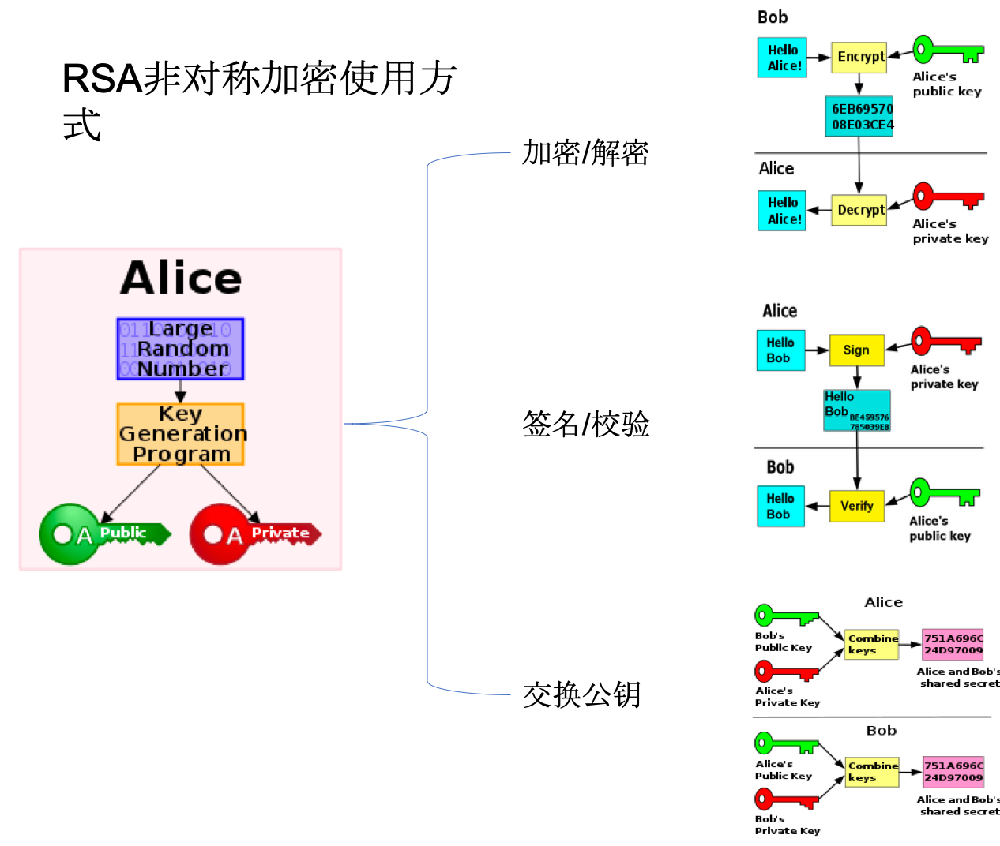

# Activity
#### 1.生命周期

答：onCreate 创建  onStart 启动 onResume 可见 onPause 失去焦点 onStop 不可见 onDestroy 销毁

	a.默认Dialog对activity的生命周期没有影响。如果一个Theme为Dialog的Activity弹出，则生命周期应该为：
	A.onPause -> B.onCreate -> B.onStart -> B.onResume;
	b.当activity A打开Activity B时 首先Activity A  onPause  然后Activity B onCreate onStart onResume 然后 Activity A onStop；
	如果B的launchMode为singleTask或者是singleInstance,并且栈中都有可以复用的Activity，那么经过的生命周期应该为：
	A.onPause -> B.onNewIntent -> B.onRestart -> B.onStart -> B.onResume -> A.onStop; 
	c.切换屏幕默认情况：Activity 会销毁重建 。当配置configChange=‘orientation’ 时则不会销毁重建，但会调用onConfigChange 方法。
	d. A activity 打开 A activity时 生命周期变化与lauch mode 相关，默认stamdard 不复用，重新创建参照 b。如果其他则会复用 所以是 onPause onNewintent （获取新的参数）onResume。
	e. app进程在后台被被GC回收时 不会执行onDestroy。抛出异常 crash 时后续什么周期都不会执行。
	f. 按下Home/menu健 onPause onStop onSaveInstanceState 通过menu杀死onDestroy

#### 2. Launch Mode

* 	standrd  标准模式  每次开启都会创建实例，不复用。
* 	singleTop 栈顶复用，会调用onNewIntent方法。pause -> restart
* 	singleTask 在任务栈中只能有一个实例，当存在时再被打开时在其上的Activity 全部销毁，而它就会处在栈顶调用onNewIntent
* 	singleInstance 单例模式 唯一实例独享任务栈 重复启动复用，调用onNewIntent

除Launch Mode外在intent中添加Flag可以更灵活的操作Activity行为：

| Flags 		| 意义及使用	｜
|:-------------|:-------------|
|Intent.FLAG_ACTIVITY_BROUGHT_TO_FRONT| 前置|
|	Intent.FLAG_ACTIVITY_CLEAR_TASK, |【 本flag能造成在新活动启动前，与新活动关联的任务被清空。也就是说，新活动成为新任务的根，旧的活动都被结束了。本flag只能与FLAG_ACTIVITY_NEW_TASK联合使用。】|
|	Intent.FLAG_ACTIVITY_CLEAR_TOP, | 相当于 singleTop|
|	Intent.FLAG_ACTIVITY_CLEAR_WHEN_TASK_RESET,||
|	Intent.FLAG_ACTIVITY_EXCLUDE_FROM_RECENTS,||
|	Intent.FLAG_ACTIVITY_FORWARD_RESULT,||
|	Intent.FLAG_ACTIVITY_LAUNCHED_FROM_HISTORY,||
|	Intent.FLAG_ACTIVITY_LAUNCH_ADJACENT,||
|	Intent.FLAG_ACTIVITY_MULTIPLE_TASK,||
|	Intent.FLAG_ACTIVITY_NEW_DOCUMENT,||
|	Intent.FLAG_ACTIVITY_NEW_TASK,||
|	Intent.FLAG_ACTIVITY_NO_ANIMATION,||
|	Intent.FLAG_ACTIVITY_NO_HISTORY,|【1. 新活动不会保留在历史栈中，一旦用户切换到其他页面，新活动会马上销毁。2. 旧活动的onActivityResult()方法永远不会被触发。】|
|	Intent.FLAG_ACTIVITY_NO_USER_ACTION,||
|	Intent.FLAG_ACTIVITY_PREVIOUS_IS_TOP,||
|	Intent.FLAG_ACTIVITY_REORDER_TO_FRONT,||
|	Intent.FLAG_ACTIVITY_RESET_TASK_IF_NEEDED,||
|	Intent.FLAG_ACTIVITY_RETAIN_IN_RECENTS,||
|	Intent.FLAG_ACTIVITY_SINGLE_TOP|【 新活动已存在历史栈的顶端时就不会重新启动。】|
|	Intent.FLAG_ACTIVITY_TASK_ON_HOME,||
	
### 	AMS 中的数据结构
AMS 职责 ：进程管理，权限管理，Config管理， 四大组件的管理（Activity的启动生命周期，任务栈，历史记录及状态转换的维护。服务的状态广播队列【前台和后台】，接收者管理，），内存管理（应用内存的回收，OOM 处理，Activity的内存回收等等）。

1. ActivityRecord：代表一个运行中Activity。
2. TaskRecord：成员ArrayList<ActivityRecord> mActivities 用来存储代表Activity的 ActivityRecord。
3. ActivityStack：成员ArrayList<TaskRecord> mTaskHistory 存储代表 Task 的TaskRecord
4. ProcessRecord：代表一个运行中的进程，包含进程的信息。

#### 3. 启动流程
##### Launcher进程  向AMS 发起启动请求
**Launcher** 调用startAppSortcutOrInfoActivity-> startActivitySafely ->startActivity  -> **Launcher**  startActivityForResult -> **Instrumentaion(仪表盘)** execStartActivity  -> **ActivityManager**.getService/ ActivityManagerNative.getDefault 获取AMS在client端的代理对象ActivityManagerProxy（实质是binder代理对象） startActivity  通过onTransact将要启动Activity的信息传递给AMS。
参数：	IApllicationThread 客服端代理对象。IPC AMS通知Launcher pause stop
        	token Activity attach的时候赋值
        	intent 等

##### AMS进程
 AMS startActivity 创建ActivityRecord TaskRecord ActivityStack等注册管理。检查启动目标的进程是否存在
 存在的话 继续
 
##### Launcher进程 
ApplicationThread      H         ActivityThread 

##### APP进程 
ApplicationThread ->binder线程   H ->  ActivityThread ui线程 performLaunchActivity
ContextImpl appContext = createBaseContextForActivity(r)创建mBase
通过mInstrumentation.newActivity()反射创建Activity
Application app = r.packageInfo.makeApplication(false, mInstrumentation); 创建Application

        
        
        
# Context
### 1. context继承关系
> Context 抽象类 上下文主要用于获取资源 SP Resource Assets Intent PackageManager ContentResolver
> >ContextIml  所有功能的实现都在这里
> 
> >ContextWrapper 外观设计模式，内部都包含一个ContextIml mBase
> > >
> > > Service
> > > 
> > >Application
> > >
> > >  ContextThemeWrapper
> > > > Activity

### getApplication()和getApplicationContext()
是同一个对象 Application在进程中只有一个实例它本身就是Context ，所以getApplicationContext()所得到的 也可以是Application对象。只不过getApplication是在Activity和Service中才有。getApplicationContext 是Context的方法 ；Activity getApplication attach的时候传入的。

### 正确使用Context
Context 使用导致内存泄漏。静态资源持有Activity，Handler
1：当Application的Context能搞定的情况下，并且生命周期长的对象，优先使用Application的Context。
2：不要让生命周期长于Activity的对象持有到Activity的引用。
3：尽量不要在Activity中使用非静态内部类，因为非静态内部类会隐式持有外部类实例的引用（Handler）
如果使用静态内部类，将外部实例引用作为弱引用持有。

#Srvice
### 启动服务的两种方式和相应的生命周期
1. **start:**  context.startService()		onCreate->onStartCommond->onDestroy
2. **bind:**  context.bindService()		onCreate->onBind->onUnbind->onDestroy

### onRebind什么情况下会被调用？
onUnbind 返回true，所有的绑定都解绑后再次绑定时会执行！

### 服务优先级的提升（保活）
1. Manifest中intentFilter 中 priority 值越大优先越高。
2. onStartCommond 中 startForeground 与通知绑定提升为为前台服务
3. onStartCommond中返回 START_STICKY_COMPATIBILITY 或 START_STICKY成为粘性服务，被系统回收时会尝试重启。
4. 设置守护进程，通过IPC保活。

### IntentSrvice 
onHandleIntent 在子线程中执行，执行完后自动销毁。实现原理HandlerThread。

#BroadCast 
可用于IPC 实现原理binder。
### 广播接收者注册 
context.registerReceiver(receiver,filter)
### 广播的发送     
sendBroadcast(intent);
sendOrderedBroadcast(intent,"");
### 广播的类型
1. 注册方式静态注册（manifest中注册）和动态注册（代码）
1. 接收方式 **有序广播**和**无序广播** 有序广播 按优先级 接收并且可以决定是否继续传递下去。无序广播按注册顺序发送。
### 广播拦截（有序广播）
abortBroadcast();

### 广播的接收
除了action 和 intentfilter ，可以通过权限来控制接受者的范围。
AMS广播队列有两个mFgBroadcastQueue和mBgBroadcastQueue 根据intent的Flag过设置FLAG_RECEIVER_FOREGROUND来决定
前台广播队列的超时时间比后台广播队列短很多
后台广播队列在当前用户后台启动服务超过阈值时会暂停广播
前台广播允许接收者以前台优先级运行
### 本地广播的使用
	
    LocalBroadcastManager instance = LocalBroadcastManager.getInstance(this); //获取帮助类
    instance.sendBroadcast(intent); // 发送广播
    filter.addAction("");
    instance.registerReceiver(receiver, filter); // 注册接收者
    instance.unregisterReceiver(receiver); // 取消注册
本地广播不会垮进程进程传递数据，所以更安全高效，只在当前进程中可以接收广播。

# ContentProvider
> Content providers负责管理结构化数据的访问，封装数据并且提供一套定义数据安全的机制。
> ContentObserver对数据（数据采用uri描述）进行监听，当监听到数据变化通知时，系统就会调用ContentObserver的onChange()方法
> 调用getContentResolver().notifyChange(uri, null)来通知注册在此URI上的访问者

# ANR
###1.是什么导致了ANR？
在Android中，程序的响应性是由ActivityManager与WindowManager系统服务来负责监控的。
当系统监测到下面的条件之一时会显示ANR的对话框：

1. 对输入事件(例如硬件点击或者屏幕触摸事件)，5秒内都无响应。
2. BroadReceiver不能够在10秒内结束接收到任务（onReceive方法执行时长，前台10s 后台60s）。
3.  Service 前台20s后台200s未完成启动
4.  ContentProvider的publish在10s内没进行完：

对于你的应用中任何可能长时间执行的操作，你都不应该执行在UI线程。
根本原因

* 1:主线程频繁进行耗时的IO操作：如数据库读写
* 2:多线程操作的死锁，主线程被block；
* 3:主线程被Binder 对端block；
* 4:System Server中WatchDog出现ANR；
* 5:service binder的连接达到上线无法和和System Server通信
* 6:系统资源已耗尽（管道、CPU、IO）

###2.如何避免ANRs？
1. 对于你的应用中任何可能长时间执行的操作，你都不应该执行在UI线程。
如网络请求，文件I/O，复杂的计算等。应放在工作线程中执行。
2. 创建自己的线程或者HandlerThread稍微复杂一点。如果你想这样做，你应该通过Process.setThreadPriority()
并传递THREAD_PRIORITY_BACKGROUND来设置线程的优先级为"background"。如果你不通过这个方式来给线程设置一个低
的优先级，那么这个线程仍然会使得你的应用显得卡顿，因为这个线程默认与UI线程有着同样的优先级。
3. 不阻塞UI线程来等待工作线程的结果，通过UI线程创建Handler提供给工作线程来，来监听并响应工作线程。
4. BroadcastReceiver有特定执行时间的限制说明了broadcast receivers应该做的是：简短快速的任务，避免执行费时
的操作，例如保存数据或者注册一个Notification。正如在UI线程中执行的方法一样，程序应该避免在broadcast receiver
中执行费时的长任务。但不是采用通过工作线程来执行复杂的任务的方式，你的程序应该启动一个IntentService来响应intent
 broadcast的长时间任务。

###3.增加响应性
通常来说，100ms - 200ms是用户能够察觉到卡顿的上限。这样的话，下面有一些避免ANR的技巧：

* 如果你的程序需要响应正在后台加载的任务，在你的UI中可以显示ProgressBar来显示进度。
* 对游戏程序，在工作线程执行计算的任务。
* 如果你的程序在启动阶段有一个耗时的初始化操作，可以考虑显示一个闪屏，要么尽快的显示主界面，然后马上显示一个加载的
对话框，异步加载数据。无论哪种情况，你都应该显示一个进度信息，以免用户感觉程序有卡顿的情况。
* 使用性能测试工具，例如 Systrace 与 Traceview来判断程序中影响响应性的瓶颈。

### ANR的定位
日志保存在trace文件保存到了/data/anr/traces.txt，日志解析：
定位：am_anr 
ANR时间：07-20 15:36:36.472
进程pid：1480
进程名：com.xxxx.moblie
ANR类型：KeyDispatchTimeout
CUP的使用率。

#Android消息机制
	
	ActivityThread.java
    --------------------------------------------------------------
        public static void main(String[] args) {
        ...
            Looper.prepareMainLooper();
            ...
            ActivityThread thread = new ActivityThread();
            thread.attach(false, startSeq);
   
            if (sMainThreadHandler == null) {
                sMainThreadHandler = thread.getHandler();
            }
            ...
            Looper.loop();
            throw new RuntimeException("Main thread loop unexpectedly exited");
        }
### Looper 
构造函数私有 通过静态方法 prepare() 来为当前线程创建实例。 
线程唯一 保存在 ThreadLocal 用来保存线程私有的数据 getMap(curThread)得到ThreadLocalMap.getEntry(ThreadLocal) 的Looper。静态方法loop 先检查当前线程是否存在Looper 存在则for (;;)开启无线循环，从MessageQueue中取消息调用 msg.target.dispatchMessage(msg);处理消息 Message msg.target就是发送他的 handler

### MessageQueue 
Looper在创建时就会在构造函数中创建 mQueue = new MessageQueue(quitAllowed)；
queue.enqueueMessage(msg, uptimeMillis) 对消息进行排序插入消息队列
MessageQueue中有几个native方法

    private native static long nativeInit();  在java的MessageQueue创建时C++同时也会创建消息队列
    private native static void nativeDestroy(long ptr);销毁消息队列
    private native void nativePollOnce(long ptr, int timeoutMillis); /*non-static for callbacks*/ epull机制唤醒C++层的looper 来读取消息
    private native static void nativeWake(long ptr);
    private native static boolean nativeIsPolling(long ptr);
    private native static void nativeSetFileDescriptorEvents(long ptr, int fd, int events);
    
### epoll机制
Linux 的I/O 多路复用机制。全名event poll，同时管理大量的文件描述符。

1. **epoll_create 创建epoll对象。**
1. **epoll_ctl 将文件描述符的事件注册到epoll中。**参数包括 文件描述符fd（检测对象）op（操作类型 增删改） epoll_event(事件详情)
1. **epoll_await 等待事件的到来**

> epoll_event 包含 事件类型 EPOLLIN/EPOLLOUT/EPOLLERR/EPOLLHUP  和 event_data

### Handler 
负责发送消息（sendXXX Message 和post Runnable 最终被封装成Message 的.callBack）和并在创建的线程处理消息处理消息（onHandlerMessage）
所有发送消息最终调用 enqueueMessage --> msg.target = this
在调用 MessageQueue.enqueueMessage(msg, uptimeMillis)
消息处理 

    public void dispatchMessage(Message msg) {
        if (msg.callback != null) { // 
            handleCallback(msg);
        } else {
            if (mCallback != null) { // 创建handler时会创建 或者设置 
                if (mCallback.handleMessage(msg)) {
                    return;
                }
            }
            handleMessage(msg); // 最后才执行
        }
    }
    
# View
> Activity -> Window(PhoneWindow 初始化DV 及其他SysUI) ->WindowManager(WindowMangerImpl 持有Window对象) -> WindowMangerGlobal（代替WM行使管理职能，View/布局参数/ViewRootImol） ->ViewRootImpl(1触发测量摆放及绘制2接收事件并转发)->DecorView
> 
> View做为构建视图的基本单元，总是在屏幕上占据矩形区域，承担视图绘制和事件的处理。所有view以一颗树的形式被安排在Window内。view分为两大类一类是viewgroup 负责组织和放置view，他们一般是不可见的，另一类就是view可见的如文本，图片，按钮等。在窗口中展示view所占据 的位置由位置和形状决定。

### View层级
Activity  attach 和 window绑定    
PhoneWindow 创建  DecorView  
添加了 mTitleview 和mContentParent。

WindowManager
WindowManagerImpl
WindowManagerGlobal -->mViews mParams mRoots
### View的绘制流程 
> 由ViewRootImpl发起  preformTraversals（）

1. 预测量 走完整测量流程，计算需要窗口的尺寸
2. 窗口布局，与WMS通讯，协商调整窗口尺寸
3. 测量 measure 父控件为子空间提供约束，子控件在onMeasure中，根据MeasureSpec完成测量。递归从上至下测量。
4. 	摆放 layout 根据测量的尺寸却子控件的位置和形状大小。也是递归从上至下测量。 
5. 绘制 draw 使用canvas或renderScript先绘制不透明的背景，同onDraw在绘制view内容。通过dispatchDraw绘制子控件，逐层绘制，在绘制装饰（滚动条）。 子控件的绘制顺序默认按添加顺序绘制，最后绘制全部可见。改变绘制顺序需覆写getChildrenDrawingOrder 来定制绘制顺序。同时也会影响触摸事件的分发。

### ViewRootImp
#### 成员

1. ViewRootHandler **mHandler** IPC 过程中从binder线程 切到UI
2. Choreographer **mChoreographer** 通过VSYNC事件，触发重绘视图的操作，
2. Surface **mSurface**  WMS通过relayoutWIndow为其分配一块Surface
3. mWinFrame /mPendingContentInset/mPendingVisibleInset WMS会将最新 的窗口信息同步到这三个变量中。
3. **mHeight/mWidth** 窗口经过重新布局后与WMS达成一致的窗口尺寸
4. mView -> DecorView
5. mInputChannel 对接InputDispatcher的管道
6. mInputEventReceiver 用于接收输入事件
7. **RunQueue** View.post/postDelay 从attachInfo中获取ViewRootImpl的成员mHandler 执行Runnable 然而当View没有attcah 时attachInfo为空。post 的runnable会被添加到RunQueue中。ViewRootImpl在吧RunQueue中的Runnable 发送给mHandler。
#### 生命周期
构造函数-> setView->addView->...->die

### 事件输入 
  设备节点 -> EventHub ->  InputEventReader -> InputDispatcher -> InputChannel ->  InputEventReciever ->  ViewRootImpl ->  Activity ->  Window ->  DecorView ->  ViewGroup -> View
  
### 事件分类
按键事件/触摸事件/
  
### 事件传递
> android 输入事件 通过内核写入/dev/input/目录下相应的设备节点中，IMS通过INotify 和 epoll机制监听并读取如数事件将其翻译 并包装成KeyEvent/MotionEvent 通过WMS 分发给Window，
再通过ViewRootImpl分发给View。
InputEventReciever（InputChannel ，Looper）// 事件接收 receiver.onInputEvent（）QueueInputEvent

事件分发分两种：按键事件按焦点派发，触摸世界按位置分发。

### View优化

### 动画 

控件的动画有三种：
ValueAnimator/ ObjectAnimator/ViewPropirtyAnimator 属性动画。
LayoutTransition 类 使用ObjectAnimator来实现ViewGroup中删除和添加子view的动画
View.startAnimation 开启动画。

<!--Animation 包含四类动画 平移 缩放 旋转 和透明度 
描述一个动画过程，起、止状态，时长，延时，变化速率。
Transformation 类描述了一个变换 主要包含：透明度和一个二维矩阵变换
Choreographer 对动画逐帧渲染 postCallback-->
### 屏幕适配

1. Animation and Transform

###6. Android 屏幕渲染机制
###7. Android dalvik虚拟机和Art虚拟机的优化升级点
###8. Android 系统启动过程
###9.

fragment 生命周期 ：
onAttach onCreate onCreateView onViewCreated onActivityCreated onStart onResume
onPause onStop onDestroyView onDestroy onDetach

###10. AMS

###11. WMS

###12.RecyclerView
#### 12.1 RecyclerView （androidx.recyclerview.widget）
继承 ViewGroup 实现了ScrollingView, NestedScrollingChild2, NestedScrollingChild3等接口

Adapter ：{Adapter}的子类负责提供表示数据集中项的视图
Position：数据项在适配器内的位置.
Index：在调用{getChildAt}时使用的附加子视图的索引
Binding：准备子视图以显示与适配器中位置对应的数据的过程。
Recycle（view）：以前用于显示特定适配器的数据的视图位置可放置在缓存中，以便稍后重用，这可以跳过初始和布局构建，
            从而极大地提高性能
            回收者负责管理废弃的或分离的项目视图，以便重用。一个“废弃的”视图是一个仍然附加到它的父视图的视图，
            但是已经被标记为删除或重用。{@link LayoutManager}回收器的典型用途是获取表示给定位置或项目ID的数
            据的适配器数据集的视图。如果要重用的视图被认为是“脏的”，适配器将被要求重新绑定它。如果没有，
            LayoutManager可以快速重用视图，而不需要做进一步的工作。

            没有请求布局{@link android.view.View#islayoutrequest () is false}的干净视图可以被
            LayoutManager重新定位而不需要重新测量

Scrap（view）：在布局期间进入临时分离状态的子视图。废弃视图可以在不完全脱离父类RecyclerView的情况下被重用，如果
            不需要重新绑定，可以不修改;如果视图被认为是脏的，可以由适配器修改
Dirty（view）：一个子视图，在显示之前必须由适配器rebound

RecyclerView在{@link Adapter}和{@link LayoutManager}之间引入了额外的抽象级别，以便能够在布局计算期间检测批
处理中的数据集更改。这使LayoutManager不必跟踪适配器更改来计算动画。它还有助于提高性能，因为所有视图绑定同时发生，
避免了不必要的绑定。
因此，在RecyclerView中有两种position相关方法:
布局位置:Item在最新布局计算中的位置。这是 从布置图经理的角度来看职位
适配器位置:一个Item在适配器中的位置。这是我们的位置 适配器的透视图。
除了调度adapter.notify*事件并计算更新后的布局的时间外，这两个位置是相同的。

LayoutManger
ViewHolder
DiffUtil

#Glide 
Glide是一个快速高效的Android图片加载库，
注重于平滑的滚动。
Glide提供了易用的API，高性能、可扩展的图片解码管道（decode pipeline），以及自动的资源池技术。
Glide 支持拉取，解码和展示视频快照，图片，和GIF动画。Glide的Api是如此的灵活，开发者甚至可以插入和替换成自己喜爱的任何网络栈。默认情况下，Glide使用的是一个定制化的基于HttpUrlConnection的栈，但同时也提供了与Google Volley和Square OkHttp快速集成的工具库。

虽然Glide 的主要目标是让任何形式的图片列表的滚动尽可能地变得更快、更平滑，但实际上，Glide几乎能满足你对远程图片的拉取/缩放/显示的一切需求。

图片加载 过程   求网络   解码   缓存   展示

### Glide里的缓存
默认情况下，Glide 会在开始一个新的图片请求之前检查以下多级的缓存：

1. 活动资源 (Active Resources) - 现在是否有另一个 View 正在展示这张图片？
1. 内存缓存 (Memory cache) - 该图片是否最近被加载过并仍存在于内存中？

1. 资源类型（Resource） - 该图片是否之前曾被解码、转换并写入过磁盘缓存？
1. 数据来源 (Data) - 构建这个图片的资源是否之前曾被写入过文件缓存？

前两步检查图片是否在内存中，如果是则直接返回图片。后两步则检查图片是否在磁盘上，以便快速但异步地返回图片。如果四个步骤都未能找到图片，则Glide会返回到原始资源以取回数据（原始文件，Uri, Url等）。
关于 Glide 缓存的默认大小与它们在磁盘上的位置的更多细节，或如何配置这些参数，请查看 配置 页面。

### Bitmap 池
Glide 使用 LruBitmapPool 作为默认的 BitmapPool 。LruBitmapPool 是一个内存中的固定大小的 BitmapPool，使用 LRU 算法清理。默认大小基于设备的分辨率和密度，同时也考虑内存类和 isLowRamDevice 的返回值。具体的计算通过 Glide 的 MemorySizeCalculator 来完成，与 Glide 的 MemoryCache 的大小检测方法相似。

### 各级缓存的实现原理：
内存缓存分为两级 ，Engine先通过loadFromActiveResources 方法获取活跃资源缓存，ActiveResource使用HashMap缓存 EngineResource的弱引用。如果有则返回没有再调用 loadFromCache 来获取内存缓存，内存缓存实现者LruResourceCache 继承自 LruCache（有LinkedHashMap + Lru算法实现）。获取内存缓存时调用的remove方法，取出后进入ActiveResource中缓存，以保证内存中同时只存在一份。资源不在Active的时候通过deactivate 方法从activeResource中移除，缓存至内存缓存中。（前题是配置允许内存缓存）
当内存缓存中获取不到时，则需要异步加载。

调用 waitForExistingOrStartNewJob 开始查找磁盘缓存， 首先在jobs（保存正在执行的Job）中查找，又有者将其封装成LoadStatus返回，LoadStatus可以通过cancel方法取消对当前Job的监听，不在关注加载结果，但job的全部cbs 中的CallBack全部被移除时，job也就会被释放。如果job不存在则new一个EngineJob 和 DecodeJob 并且EngineJob 然后返回LoadStatus。

Job start 会根据job的参数选择具体executor  根据Job的Stage 来判断如果已经是RESOURCE_CACHE｜DATA_CACHE 阶段直接叫个diskCacheExecutor执行DecodeJob。否则根据Glide配置useUnlimitedSourceGeneratorPool 觉得是否用sourceUnlimitedExecutor 再根据useAnimationPool决定是否用animationExecutor 都不需要则用sourceExecutor执行DecodeJob。

DecodeJob执行过程：DJ实现了Runner是个线程，
一个DecodeJo的完整阶段如下，但也可以通过不同的
初始阶段 (INITIALIZE)
从缓存资源解码(RESOURCE_CACHE) 资源缓存中解码
从缓存的源数据解码（DATA_CACHE）元数据缓存中解码
从检索到的源解码（SOURCE）
成功加载后对转换的资源进行编码（ENCODE ）
没有更多可行的阶段（FINISHED）

从run方法开始： 

1. 初始化 DataFetcher 
2. 判断任务是取消如果取消，通知加载失败，return；否则runWrapped
3. runWrapped根据RunReason 来执行：
	* 	INITIALIZE  第一次提交。 先确定下一个状态
	*  	SWITCH_TO_SOURCE_SERVICE 我们需要从磁盘缓存切换到 资源
	*    DECODE_DATA

四个GlideExecutor 的区别：

* diskCacheExecutor  最大线程数1 ，用来执行解码磁盘缓存的线程池
* sourceUnlimitedExecutor 核心线程数0 工作线程数无限大 存活10s
* animationExecutor 执行动画的线程 cpu数超过4时是两个线程否则只有一个线程。
* sourceExecutor 允许网络来管理线程池 默认线程数 min（4， cpu数）

计算最佳线程数：自动计算时最多分配四个线程  最多可用线程数通过cpu数量来确定
<!--Why？为什么有内存还要加个active 缓存呢 ？是为在不同场景下快速命中缓存。假设只有LruCache 在内存空间中是固定大小的。活跃状态下的资源加入到缓存中，每次使用查询效率低，-->

Glide的优点：
	1.生命周期敏感，
	2.资源的复用，Bitmap
	3.强大的缓存机制。
	4.丰富解码器应对不同的数据来源，本地文件，资源，包括gif，视屏封面等。
	5.API 灵活易拓展，可配置性高，链式调用使用简节方便。
	6.图片按需加载，列表的滚动过程中加在当前显示的优先加在。

#Http
> http是一个简单的请求-响应协议，它通常运行在TCP之上的应用层协议。
>
> 报文格式：
>>	请求头(Method  url  http[version] ) － request header － request body
>>
>>	响应头(http[version]  stateCode msg) － respose header －respose body

### 1.UDP 与 TCP 
UDP 无连接 无状态 高效 不安全(不保证数据一定传达)
TCP 有链接 有状态 安全（确保数据包不会丢失）建立连接 三次握手 断开连接四次挥手。
SSL/TLS  拿到应用层传递的内容用对其进行 对称加密AES  签名 ， 密钥 用 非对称加密RSA    服务端先用私钥解密 对称加密的密钥然和解密内容 传递给应用层
### 2.Http 1.1 / SPDY / Http 2.0对比

Http 1.1 ：串行请求

SPDY：
规定通信中使用 SSL（强制Https）， SPDY 以会话层的形式加入，控制对数据的流动，但还是采用 HTTP 建立通信连接。
 一次TCP连接，多次Http请求响应，优先级，头压缩，推送，服务器提示。
Http 2.0 ：支持IO 多路复用 并行请求 ，消息头的压缩算法采用 HPACK  服务端推送（Server Push）对客户端的一个请求发送多个相应。
###  3.Https
超文本传输安全协议（Hypertext Transfer Protocol Secure），1994年由网景公司提出，Https经由Http进行通信，但利用SSL/TLS来加密数据，即在Http协议与TCP协议之间添加SSL/TLS层。
### RSA

#Android性能优化
## 分三个阶段：
布局
#### 开发阶段：
Lint 代码检测。内存泄漏检测LeakCannery
#### 打包发布：
资源压缩
dex优化
#### 线上运行阶段实时性能检测：
Crash/ANR/UI卡顿检测/启动时长

1. 启动优化：设置windowBackground 避免启动黑白屏幕。
1. 绘制优化：
1. 内存优化：
1. 图片：
1. 存储优化：
2. 流量优化：
3. apk

adb shell procrank //  获取进程排名
adb shell getprop | grep dalvik.vm.heapsize //  堆内存的阀值
adb shell cat /proc/meminfo //  查看内存使用情况
adb shell dumpsys meminfo [ packagename/pid] //查看进程的内存信息

应用程序如何绕过dalvikvm heapsize的限制?
1 .创建子进程,使用android:process标签
2.使用jni在native heap上申请空间（推荐使用）
3.使用显存（操作系统预留RAM的一部分作为显存）开启硬件加速。
关于bitmap是 调用native方法创建，但对象引用还在java层，属于Java对象所以是分配在VM heap上 ，古图片加载会出现OOM。
dakvikvm heap 分为 zygote heap 和 active heap，zygote heap上的对象

