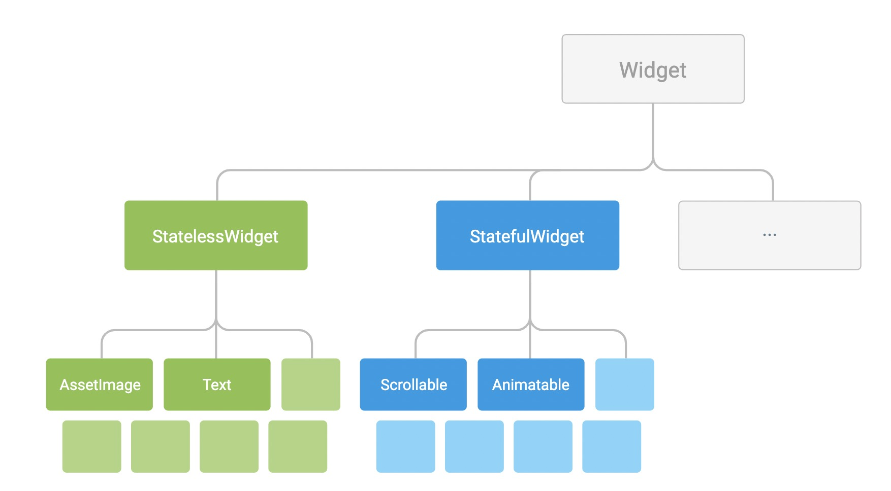

##Flutter 使用
### [环境搭建](https://flutter.cn/docs/get-started/install)
1. 下载解压 Flutter SDK ，并配置环境变量；
2. 在终端输入： flutter doctor 来检查开发环境是否完善。如下信息表示环境搭建OK。

```
	$ flutter doctor
	Doctor summary (to see all details, run flutter doctor -v):
	[✓] Flutter (Channel stable, v1.12.13+hotfix.9, on Mac OS X 10.15.5 19F101, locale zh-Hans-CN)
	 
	[✓] Android toolchain - develop for Android devices (Android SDK version 29.0.2)
	[✓] Xcode - develop for iOS and macOS (Xcode 11.5)
	[✓] Android Studio (version 4.0)
	[✓] IntelliJ IDEA Ultimate Edition (version 2017.3.2)
	[✓] Connected device (1 available)
	
	• No issues found!
```
3.编辑工具  安装 Android Studio 并安装 Flutter 和 Dart 插件（建议使用Android studio， vs也可以使用功能不如as 强大）

### 初始化项目
####命令创建
```
	$ flutter create [package_name] // eg: 'com_fengjr_flutter_mobile'
```
####IDEA创建
AS 安装完插件重启后，File -> New ->New Flutter Project   选择 Application 填写项目名称， 下一步 填写包名 finish。
### 项目结构
> android   		//安卓项目  
> ios  			// ios 项目  
> asset  		// 资源目录 比如图片 文件 json 等  
> lib  			// dart 代码目录  
> > main.dart	// 入口文件       
>    			 
> pubspec.yaml 	// 项目配置  
 
```
name: flutter_app  # 项目名称
description: A new Flutter application. # 项目描述
version: 1.0.0+1  # 项目版本号
environment:  # dart语言sdk 版本限制
  sdk: ">=2.7.0 <3.0.0"
dependencies: # 三方依赖
  flutter:
    sdk: flutter
dev_dependencies: # 开发时需要的依赖，如代码生成器 
  flutter_test:
    sdk: flutter
  build_runner: ^1.10.0

flutter:   # flutter 的配置
  uses-material-design: true
  # To add assets to your application, add an assets section, like this:
  assets: # flutter 项目中引用到的资源都要在此配置路径。
    - assets/images/abc.jpg
    - assets/images/bcd.jpg
    - assets/images/meinv.webp
    - assets/json/env.json
  # fonts: # flutter 字体配置
  #   - family: Schyler
  #     fonts:
  #       - asset: fonts/Schyler-Regular.ttf
  #       - asset: fonts/Schyler-Italic.ttf
  #         style: italic
  #   - family: Trajan Pro
  #     fonts:
  #       - asset: fonts/TrajanPro.ttf
  #       - asset: fonts/TrajanPro_Bold.ttf
  #         weight: 700
  #
  # For details regarding fonts from package dependencies,
  # see https://flutter.dev/custom-fonts/#from-packages

``` 

### UI组件
#### Widget 构建UI 界面基本构建单元。


``` 
	Object (dart.core)
		Diagnosticable (diagnostics.dart)
			DiagnosticableTree (diagnostics.dart)
				Widget (framework.dart)
					StatelessWidget (framework.dart) // 无状态的 内部属性全部是final的，无需改变状态
					StatefulWidget (framework.dart) // 有状态的 
					RenderObjectWidget (framework.dart) 
					ProxyWidget (framework.dart)
``` 

#### Widget 的生命周期事件


 
在 StatefulWidget 上调用 createState() 之后，框架将新的状态对象插入到树中，然后在状态对象上调用 initState()。

State 的子类可以重写 initState 来完成只需要发生一次的工作。
例如，重写 initState 来配置动画或订阅平台服务。
实现 initState 需要调用父类的 super.initState 方法来开始。

Widget 的 build(BuildContext context);构建widget树。

当不再需要状态对象时，框架会调用状态对象上的 dispose() 方法。可以重写dispose 方法来清理状态。
例如，重写 dispose 以取消计时器或取消订阅平台服务。
实现 dispose 时通常通过调用 super.dispose 来结束。

####[ 常用widget](https://flutter.cn/docs/development/ui/widgets)
#### 屏幕适配

### 异步操作
#### Future and Stream
dart:async 库中有两个类型 Stream 和 Future。 Future 用于表示不会立即完成单个运算的结果，而 Stream 则表示多个结果的序列。你可以监听 Stream 以获取其结果（包括数据和错误）或其关闭事件。也可以在 Stream 完成前对其暂停或停止监听。

**Future**
1.通过 async 函数默认返回的就是Future对象。

``` 
	Future<String> createF() async {
		.......
	 	return 'name';
	}
``` 
2.通过构造函数创建 

``` 
	// Future(FutureOr<T> computation())
	Future<String> future = Future(() => '你好 ！Future');
	// Future.delayed(Duration duration, [FutureOr<T> computation()])
	Future<String> future = Future.delayed(Duration(seconds: 10), () => '你好 ！Future');
	// Future.error(Object error, [StackTrace stackTrace])
  	Future<String> future = Future.error('Future error obj');
	// Future.microtask(FutureOr<T> computation())
	Future<String> future = Future.microtask(() => '你好 ！Future');
	// Future.sync(FutureOr<T> computation())
	Future<String> future = Future.sync(() => '你好 ！Future');
	// Future.value([FutureOr<T> value])
	Future<String> future = Future.value('你好 ！Future');
```
3.静态方法 

*   Future.any(); // 返回最先完成的Future
*   Future.doWhile() // 重复执行一步任务直到返回值为false
*   Future.forEach() // 逐个执行
*   Future.wait() // 执行所有任务等全部完成，并收集结果。

4.Future 的执行：

``` 
	var value = await future;
	// 或者 l
	future.timeout(Duration(seconds: 10), onTimeout: () {
		    print('onTimeout');
		    return 'timeout';
		  }).then((value) {
		    print(value);
		  }).catchError((e) {
		    print('catchError');
		  }).whenComplete(() {
		    print('whenComplete');
		  });
``` 
**Stream**

1.通过 async * 函数创建。

``` 
	// async* + yield 创建 Stream
	Stream<int> countStream(int to) async* {
	  for (int i = 1; i <= to; i++) {
	    yield i;
	  }
	}
``` 
2.通过构造函数创建。

``` 
Stream() // 默认构造
Stream.empty() // 创建一个空的stream 不包含事件。
Stream.error(Object error, [StackTrace stackTrace]) // 创建包含error事件的stream
Stream.fromFuture(Future<T> future) // 通过Future创建
Stream.fromIterable(Iterable<T> elements) // 通过可迭代对象创建
Stream.periodic(Duration period, [T computation(int computationCount)]) //每隔一段时间触发一次
Stream.value(T value) // 单一的值创建
``` 
3.接收 Stream 事件

``` 
Future<int> sumStream(Stream<int> stream) async {
  var sum = 0;
  await for (var value in stream) {
    sum += value;
  }
  return sum;
} 
``` 
listen() 方法 最后一个重要的方法是 listen()。这是一个“底层”方法，其它所有的 Stream 方法都根据 listen() 方法定义。
``` 
 var stream = timedCounter(Duration(seconds: 2), 3);
stream.listen((a) {
    print(a);
  },onError: (){
    
  },onDone: (){
    
  },cancelOnError:true);
``` 
4.使用 StreamController

``` 
	// 注意：该实现有缺陷。
	// 它在它拥有订阅者之前开始并且它没有实现暂停逻辑。
	Stream<int> timedCounter(Duration interval, [int maxCount]) {
	  var controller = StreamController<int>();
	  int counter = 0;
	  void tick(Timer timer) {
	    counter++;
	    controller.add(counter); // 请求 Stream 将计数器值作为事件发送。
	    if (maxCount != null && counter >= maxCount) {
	      timer.cancel();
	      controller.close(); // 请求 Stream 关闭并告知监听器。
	    }
	  }
	
	  Timer.periodic(interval, tick); // 缺点：在其拥有订阅者之前开始了。
	  return controller.stream;
	}
``` 
5.Stream的方法

	* any(bool test(T element)) → Future<bool>
	* asBroadcastStream({void onListen(StreamSubscription<T> subscription), void onCancel(StreamSubscription<T> subscription)}) → Stream<T>
	* asyncExpand<E>(Stream<E> convert(T event)) → Stream<E>
	* asyncMap<E>(FutureOr<E> convert(T event)) → Stream<E>
	* cast<R>() → Stream<R>
	* contains(Object needle) → Future<bool>
	* distinct([bool equals(T previous, T next)]) → Stream<T>
	* drain<E>([E futureValue]) → Future<E>
	* elementAt(int index) → Future<T>
	* every(bool test(T element)) → Future<bool>
	* expand<S>(Iterable<S> convert(T element)) → Stream<S>
	* firstWhere(bool test(T element), {T orElse()}) → Future<T>
	* fold<S>(S initialValue, S combine(S previous, T element)) → Future<S>
	* forEach(void action(T element)) → Future
	* handleError(Function onError, {bool test(dynamic error)}) → Stream<T>
	* join([String separator = ""]) → Future<String>
	* lastWhere(bool test(T element), {T orElse()}) → Future<T>
	* listen(void onData(T event), {Function onError, void onDone(), bool cancelOnError}) → StreamSubscription<T>
	* map<S>(S convert(T event)) → Stream<S>
	* pipe(StreamConsumer<T> streamConsumer) → Future
	* reduce(T combine(T previous, T element)) → Future<T>
	* singleWhere(bool test(T element), {T orElse()}) → Future<T>
	* skip(int count) → Stream<T>
	* skipWhile(bool test(T element)) → Stream<T>
	* take(int count) → Stream<T>
	* takeWhile(bool test(T element)) → Stream<T>
	* timeout(Duration timeLimit, {void onTimeout(EventSink<T> sink)}) → Stream<T>
	* toList() → Future<List<T>>
	* toSet() → Future<Set<T>>
	* transform<S>(StreamTransformer<T, S> streamTransformer) → Stream<S>
	* where(bool test(T event)) → Stream<T>

6.Stream 有两种类型：**Single-Subscription 和 Broadcast**

* Single-Subscription 类型的 Stream 只能被一个订阅者监听

* Broadcast 类型的 Stream 可以被多个订阅者监听

#### 异步Widget  FutureBuilder 和 StreamBuilder

### 状态存储

#### 页面状态 
StatefulWidgets createState 保存在state中 ，随着State dispose时销毁。
#### 全局状态
1. 引入provider包

	``` 
		dependencies:
			...
			  provider: ^4.0.0 # 全局状态管理
	``` 

2. 创建model
	
	继承 ChangeNotifier 提供数据和改变数据的方法。
	
3. 注册priveder
	在创建APP的时候注册priveder
	
	``` 
	void main() => runApp(MultiProvider(providers: [
      ChangeNotifierProvider(create: (context) => HostModel()),
      ...
    ], child: MyApp()));
	```
4. 使用
	* 	在widget构建时使用 Consumer 
	
	``` 
	Consumer<HostModel>(
          child: Text("$host"),
          builder: (context, hostModel, child) {
            print(hostModel.hostMap);
            var curHost = hostModel.hostMap[widget.host.hostId];
            return RadioListTile(
              activeColor: Colors.blue,
              title: Text(
                host,
                style: textBlack16,
              ),
              value: host,
              onChanged: (value) {
                hostModel.setHost(widget.host.hostId, value);
              },
              groupValue: curHost,
            );
          })
	``` 
	* 	在没有UI的情况下使用
	
	``` 
	var model = Provider.of<HostModel>(appContext, listen: false)
	``` 
	
### 路由导航
 **页面 和 退出 （push 和 pop）**：从 CurrentPage跳转到 TargetPage 为例

``` 
// CurrentPage 跳转传参  两种方式：1 构造函数传参 2 使用RouteSettings传参 （推荐使用这种，更灵活）
Navigator.push(pageContext, MaterialPageRoute(
	builder: (context) => TargetPage(), 
	settings: RouteSettings(arguments: [arguments])
	));
// TargetPage  参数提取
final var arguments = ModalRoute.of(context).settings.arguments;
//TargetPage 返回结果
Navigator.pop(pageContext, [resunt]);
// CurrentPage 结果提取
var result = await Navigator.push(...)
``` 

### 序列化与反序列化
#### dart:convert
* jsonDecode()  	将Json String转化成List 或者 Map
* jsonEncode() 	将List 或者 Map转化成Json String

#### json_annotation 自定义数据类型转换 


#### [build_value](https://juejin.im/post/5ed7562df265da76e7652481)

### [网络请求 dio 与 retrofit](https://github.com/flutterchina/dio/blob/master/README-ZH.md)
dio是一个强大的Dart Http请求库，支持Restful API，FormData，拦截器，请求取消，Cookie管理，文件上传/下载，超时，自定义适配器等...

retrofit是一个拓展包。

###[ NoSql 数据库 Hive](https://juejin.im/post/5ef2f07d6fb9a058556f0963)

##Widgets

### Layout


### 可滚动的长列表

####ScrollView

	StatelessWidget
	|__SingleChildScrollView
	|__ScrollView (scroll_view.dart)
		 |__BoxScrollView (scroll_view.dart)
		 |    |__ListView (scroll_view.dart)
		 |    |__GridView (scroll_view.dart)
		 |__CustomScrollView (scroll_view.dart)
		      |__ _NestedScrollViewCustomScrollView(nested_scroll_view.dart)
		      
		      


在mainAxis 方向是无限的（没有最大边界）。内部不可嵌套相同方向上无界的widget。

####Gradient
1. LinearGradient
2. RadialGradient
3. SweepGradient

####Box***
* BoxDecoration
* BoxBorder
* BoxShadow
* BoxPainter

####*** 
TextBox
ListWheelScrollView
ShapeBorder BoxBorder Border


##Flutter 打包部署
###Android
####准备：
1. 添加启动图
2. 创建签名密钥：


```
//macOS 或者 Linux 
keytool -genkey -v -keystore ~/key.jks -keyalg RSA -keysize 2048 -validity 10000 -alias key 
//Windows
 keytool -genkey -v -keystore c:\Users\USER_NAME\key.jks -storetype JKS -keyalg RSA -keysize 2048 -validity 10000 -alias key
``` 


**构建appbundle**

	flutter build appbundle --target-platform android-arm,android-arm64,android-x64
**构建apk**

	flutter build apk --target-platform android-arm,android-arm64,android-x64 --split-per-abi
	
### flutter Android打包过程
1. 代码 -->lib/abi/libapp.so 
dart 代码编译后生成动态连接库 libapp.so 在引擎初始化时先加载资源 在加载代码。

2. 图片等资源 -->assets/flutter_assets 

	flutter_assets/AssetManifest.json 
	flutter_assets/FontManifest.json 
	 json格式 图片和字体等资源代码中引用（key）和路径（value）的映射关系。
 

### flutter Dart与原生的互调
dart 调用 原生方法：
1.  原生注册方法。
2. dart调用。
	
	 const platform = const MethodChannel('samples.flutter.dev/battery');
	 final result = await platform.invokeMethod('methodName');
	 
3. 原生 调用dart：
	
	


