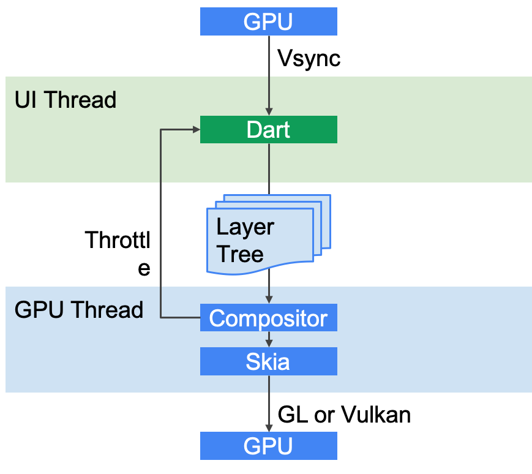

# Flutter 面试点
### Dart 当中的 「..」表示什么意思？
级联函数，访问对象属性，多层递进。
### Dart 的作用域
* ioslate 
* model 
* 全局方法
* 类内方法
* 全局变量
* class mixin
* 私有变量类方法 _开头

### Dart 是不是单线程模型？是如何运行的？
			
Dart不是单线层，可以开启多个Isolate，只是Isolate直接数据是隔离的，通过特定的方式交互。
在同一个Isolate内部是通过 消息循环实现异步操作的
通常使用 scheduleMicrotask(…)或者Future.microtask(…)方法向微任务队列插入一个任务。
通常使用 Future 向 EventQueue加入事件，也可以使用 async 和 await 向 EventQueue 加入事件。
在Dart中，所有的外部事件任务都在事件队列中，如IO、计时器、点击、以及绘制事件等，由辅助线程执行。而微任务通常来源于Dart内部。

### Dart 是如何实现多任务并行的？

Dart在单线程中是以消息循环机制来运行的，其中包含两个任务队列，一个是“微任务队列” microtask queue，另一个叫做“事件队列” event queue。微任务队列的执行优先级高于事件队列。

### 说一下Dart异步编程中的  async 关键字？
异步的对象，async 函数默认返回一个Future对象。
future的处理方式两种。一种是await 等待其计算完成。第二种调用then（）中传入毁掉函数。

### 说一下Dart异步编程中的 Stream数据流？
Stream 表示一个异步的数据序列。你可以使用 Stream API 中的 listen() 方法和 await for 关键字来处理一个 Stream。当出现错误时，Stream 提供一种处理错误的方式。
Stream 有两种类型：Single-Subscription 和 Broadcast，Stream提供了很多操作符来实现事件的转换（内部调用listen方法重新包装处理Stream） listen方法回触发事件的执行。

### Stream 有哪两种订阅模式？分别是怎么调用的？
Single-Subscription 类型的 Stream 只能被一个订阅者监听
Broadcast 类型的 Stream 可以被多个订阅者监听 
Stream 默认是Single-Subscription ，只能调用一次listen 方法，通过调用asBroadcastStream将其转换成Broadcast模式。

### await for 如何使用？
 await for 关键字来处理一个 Stream
 将Stream转换成多个Future对象
 
### 说一下 mixin机制？
混入 是Dart多态的的一种实现方式。 给当前类添加某些特征。任何类都可以被混入现有类中，也可以用mixin关键字 定义关键字定义混入类，用on关键字指定混入目标类。
实现混入的关键字是 with 介于 extend 和 implement之间。Dart是单继承
同名方法覆盖原则 离本类越远的的会被保留。

### 请简单介绍下Flutter框架，以及它的优缺点？
Flutter 是 Google 开源的响应式，快平台UI 工具包。底层实现了自己的UI渲染引擎，不依赖于平台UI模式。通过wiget来构建UI，语言Dart编程。
优点：性能强大，丰富的UI库极具表现力。跨平台。借鉴了react 响应式的UI交付，
组合式的UI结构。
热重载加快了UI调试速度。

缺点：只是UI库而已，嵌入到原生系统中，必然以来原声系统。不够成熟，版本迭代快，升级会有不兼容问题。相应的生态环境更新根本上，导致依赖版本冲突。还有很多问题需要探索。网络（翻墙的问题）。代码风格widget递进层级会很深，尽量去封装成小模块去组合。


### 介绍下Flutter的理念架构
Flutter设计为一个可扩展的分层系统。它作为一系列独立的库存在，每个库都依赖于底层。框架的每一层都被设计成可替换的，而且每一层的访问都是可替换的。

1. Framework层 Dart UI架构绘制，事件响应
2. Engine dart 运行时管理，创建运行环境，负责渲染 通信 IO
3. Embedder 负责平台对接，初始化引擎启动dart vm 建立通信通道。


### 介绍下Flutter的FrameWork层和Engine层，以及它们的作用

### 介绍下Widget、State、Context 概念 - Widget

### 简述Widget的StatelessWidget和StatefulWidget两种状态组件类

### 简述Widgets、RenderObjects 和 Elements的关系

### 什么是状态管理，你了解哪些状态管理框架？
全局状态管理还是基于InheritWidget 
provider  redux

### 简述Flutter的绘制流程

## 简述Flutter的线程管理模型
Flutter Engine要求Embeder提供四个Task Runner，Embeder指的是将引擎移植到平台的中间层代码。这四个主要的Task Runner包括：
### Platform Task Runner
Flutter Engine的主Task Runner，类似于Android Main Thread或者iOS的Main Thread。但是需要注意他们还是有区别的。
一般来说，一个Flutter应用启动的时候会创建一个Engine实例，Engine创建的时候会创建一个线程供Platform Runner使用。
跟Flutter Engine的所有交互（接口调用）必须在Platform Thread进行，否则可能导致无法预期的异常。这跟iOS UI相关的操作都必须在主线程进行相类似。需要注意的是在Flutter Engine中有很多模块都是非线程安全的。

规则很简单，对于Flutter Engine的接口调用都需保证在Platform Thread进行。

阻塞Platform Thread不会直接导致Flutter应用的卡顿（跟iOS android主线程不同）。尽管如此，也不建议在这个Runner执行繁重的操作，长时间卡住Platform Thread应用有可能会被系统Watchdog强杀。

### UI Task Runner Thread（Dart Runner）

UI Task Runner用于执行Dart root isolate代码（isolate我们后面会讲到，姑且先简单理解为Dart VM里面的线程）。Root isolate比较特殊，它绑定了不少Flutter需要的函数方法，以便进行渲染相关操作。对于每一帧，引擎要做的事情有：

Root isolate通知Flutter Engine有帧需要渲染。
Flutter Engine通知平台，需要在下一个vsync的时候得到通知。
平台等待下一个vsync
对创建的对象和Widgets进行Layout并生成一个Layer Tree，这个Tree马上被提交给Flutter Engine。当前阶段没有进行任何光栅化，这个步骤仅是生成了对需要绘制内容的描述。
创建或者更新Tree，这个Tree包含了用于屏幕上显示Widgets的语义信息。这个东西主要用于平台相关的辅助Accessibility元素的配置和渲染。
除了渲染相关逻辑之外Root Isolate还是处理来自Native Plugins的消息，Timers，Microtasks和异步IO等操作。Root Isolate负责创建管理的Layer Tree最终决定绘制到屏幕上的内容。因此这个线程的过载会直接导致卡顿掉帧。

### GPU Task Runner

GPU Task Runner主要用于执行设备GPU的指令。UI Task Runner创建的Layer Tree是跨平台的，它不关心到底由谁来完成绘制。GPU Task Runner负责将Layer Tree提供的信息转化为平台可执行的GPU指令。GPU Task Runner同时负责绘制所需要的GPU资源的管理。资源主要包括平台Framebuffer，Surface，Texture和Buffers等。

一般来说UI Runner和GPU Runner跑在不同的线程。GPU Runner会根据目前帧执行的进度去向UI Runner要求下一帧的数据，在任务繁重的时候可能会告诉UI Runner延迟任务。这种调度机制确保GPU Runner不至于过载，同时也避免了UI Runner不必要的消耗。

建议为每一个Engine实例都新建一个专用的GPU Runner线程。

### IO Task Runner

前面讨论的几个Runner对于执行流畅度有比较高的要求。Platform Runner过载可能导致系统WatchDog强杀，UI和GPU Runner过载则可能导致Flutter应用的卡顿。但是GPU线程的一些必要操作，例如IO，放到哪里执行呢？答案正是IO Runner。

IO Runner的主要功能是从图片存储（比如磁盘）中读取压缩的图片格式，将图片数据进行处理为GPU Runner的渲染做好准备。IO Runner首先要读取压缩的图片二进制数据（比如PNG，JPEG），将其解压转换成GPU能够处理的格式然后将数据上传到GPU。

获取诸如ui.Image这样的资源只有通过async call去调用，当调用发生的时候Flutter Framework告诉IO Runner进行加载的异步操作。

IO Runner直接决定了图片和其它一些资源加载的延迟间接影响性能。所以建议为IO Runner创建一个专用的线程

### Flutter 是如何与原生Android、iOS进行通信的？

### 简述Flutter 的热重载
Hot Reload 只能在 Debug 模式下使用，是因为 Debug 模式下，Flutter 采用的是 JIT 动态编译，代码是运行在 Dart VM 上，JIT 将 Dart 编译成可以运行在 Dart VM 上的 Dart Kernel，Dart Kernel 可以动态更新，所以就实现了代码的实时更新功能。
当调用 Hot Reload 时：

1.首先会扫描代码，找到上次编译之后有变化的 Dart 代码。
2.在将这些变化的 Dart 代码转化为增量的 Dart Kernel 文件。
3.将增量的 Dart Kernel 文件发送到正在移动设备上运行的 Dart VM
4.Dart VM 会将发来的增量 Dart Kernel 文件和原有的 Dart Kernel 文件合并，然后重新加载全新的 Dart Kernel。
5.这个时候，虽然重新加载了 Dart Kernel，却不会重新执行代码，而是通知 Flutter Framework 重建 Widget。

所以 Flutter 的 Hot Reload 并不会重新执行一遍代码，而是触发 Flutter 重新绘制，并且会保留 Flutter 之前的状态(注：当你退出APP，再进来的时候，状态是Hot Reload之前的状态，想要修改后的状态需要Hot Restart)，所以 Hot Reload 也被称为有状态的热重载。

## Flutter 层级架构

##  Flutter 启动流程
1. 加载顺序
1. 查找Flutter资源
1. 加载Flutter  构建FlutterEngine时
1. 启动DartVM
1. 创建DartIsolate （独立的线程）


##  Flutter 绘制过程


## Widget / Element / RenderObject
### Widget
> Widget 描述Element的配置。Widget是Flutter框架中的中心类层次结构。Widget是对一部分用户界面的不变描述。可以将Widget填充为用来管理基础render tree 的 Element。

Widget本身没有可变状态（它们的所有字段都必须为final）。如果您希望将可变状态与Widget相关联，请考虑使用 StatefulWidget，它会创建一个State对象（通过 StatefulWidget.createState），每当它inflate 成一个Element，并融入到树中。

同一个Widget可以在widget tree中的不同为多次出现。会被inflate成多个Element融入到element tree中。一个Widget 可以对应多个Element。

在Key属性控制一个Widget如何取代另一个控件树。如果两个窗口Widget的runtimeType和key属性分别是相同时，则新窗口Widget通过更新底层的Element（即，通过使用新窗口Widget调用Element.update）来替换旧窗口Widget。否则，将从树中删除旧Element，将新Widget infalte成为一个Element，然后将新Element插入到树中。

1. StatefulWidget和State，用于可以在其生命周期内多次构建的Widget。
1. InheritedWidget，用于引入可被后代Widget读取的环境状态的Widget。
1. StatelessWidget，用于在特定配置和环境状态下始终以相同方式构建的Widget。


### State 
> StatefulWidget的逻辑和内部状态。State表示的信息由两部分 1.在构建时可以同步读取的信息 2.在Widget生命周期内可能改变的信息。

#### 生命周期

### Elements 
> 定义：树中特定位置的Widget的实例。Elements形成一棵树。大多数Elements都有一个唯一的子级，但是有些Elements（例如RenderObjectElement的子类）可以有多个子级。

#### 生命周期


### Widget树的绘制原理

### 优化（避免错误使用）

* 1.控制 build() 方法的耗时。‘要确保在8ms内完成’
* 避免在 build() 方法中进行重复且耗时的工作，因为当父 widget 重建时，子 Wdiget 的 build() 方法会被频繁地调用。
* 2.仅当需要的时候才应用效果
* 3.对列表和网格列表懒加载
* 4.多用常量Widget。
* 5.不要在动画的构造函数中构建widget
## 动画
flutter 动画分为隐式动画（ImplicitlyAnimatedWidget）和显式动画（AnimatedWidget）
### ImplicitlyAnimatedWidget 
> 隐式动画 在属性发生变化时主动执行动画，内部维护了自己的AnimationController。这种动画在第一次添加到widget树中时不会触发，只有属性改变导致重绘时才会触发。这一类动画继承 ImplicitlyAnimatedWidget 动画State属性必须继承ImplicitlyAnimatedWidgetState。对于这动画是有 [duration] 和 [curve]两个参数可用。

#### 已实现的隐式动画：

* [AnimatedAlign]     			[Align]的隐式动画版本.
* [AnimatedContainer],  		[Container]的隐式动画版本.
* [AnimatedDefaultTextStyle] [DefaultTextStyle]的隐式动画版本.
* [AnimatedOpacity]  		[Opacity] 的隐式动画版本.
* [AnimatedPadding] 			[Padding] 的隐式动画版本.
* [AnimatedPhysicalModel]    [PhysicalModel]的隐式动画版本.
* [AnimatedPositioned], 		[Positioned]的隐式动画版本. 
* [AnimatedPositionedDirectional], [PositionedDirectional]的隐式动画版本.
* [AnimatedTheme],  		[Theme]的隐式动画版本.
* [AnimatedSize], 它自动将其大小转换为给定的大小持续时间。
* [AnimatedSwitcher] 从一个小部件淡入另一个小部件.
* [AnimatedCrossFade], 
* [TweenAnimationBuilder]  用于自定隐式动画

 ``` 
 /// 使用示例
AnimatedCrossFade(
	  firstChild: Container(), // 第一控件
	  secondChild: Container(),// 第二控件
	  duration: Duration(milliseconds: 200),// 持续时间
	  firstCurve: Curves.bounceIn,// 第一控件变换速率
	  secondCurve: Curves.bounceOut,// 第二控件变换速率
	  crossFadeState: CrossFadeState.showSecond,// 交错状态
),
```
### AnimatedWidget 
> 显式动画 接收一个Animation作为参数，自己手动维护一个AnimationController（注意生命周期释放资源），来控制动画。

#### 已实现的显式动画：

* [AlignTransition]，这是[Align]的动画版本。
* [DecoratedBoxTransition]，这是[DecoratedBox]的动画版本。
* [DefaultTextStyleTransition]，这是的动画版本[默认文本样式]。
* [PositionedTransition]，这是[Positioned]的动画版本。
* [RelativePositionedTransition]，这是的动画版本[定位]。
* [RotationTransition]，用于设置小部件旋转的动画。
* [ScaleTransition]，它为小部件的缩放设置动画。
* [SizeTransition]，用于设置自身大小的动画。
* [SlideTransition]，用于设置小部件相对于它的正常位置。
* [FadeTransition]，这是[Opacity]的动画版本。
* [AnimatedModalBarrier]，ModalBarrier的显式动画版
*  [AnimatedBuilder]，  用于自定义显式动画。

 ``` 
 /// 使用示例
AnimatedCrossFade(
	  firstChild: Container(), // 第一控件
	  secondChild: Container(),// 第二控件
	  duration: Duration(milliseconds: 200),// 持续时间
	  firstCurve: Curves.bounceIn,// 第一控件变换速率
	  secondCurve: Curves.bounceOut,// 第二控件变换速率
	  crossFadeState: CrossFadeState.showSecond,// 交错状态
),
```

	


ChangeNotifier
ValueNotifier


