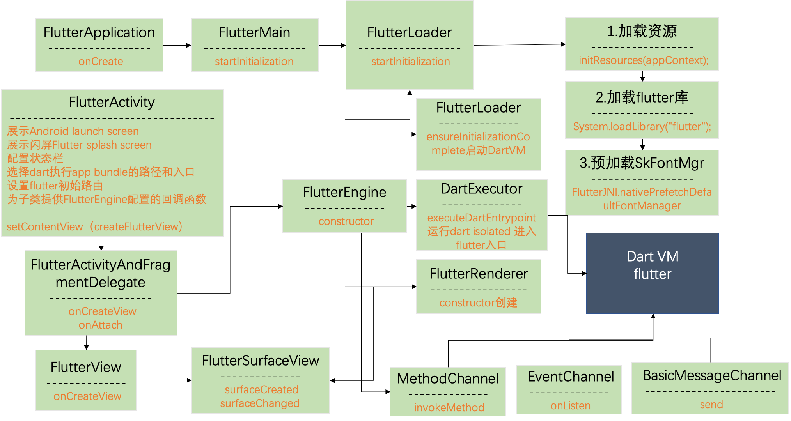

# Flutter 面试点
## Dart
> Dart是面向对象的、类定义的、单继承的语言。支持接口(interfaces)、混入(mixins)、抽象类(abstract classes)、具体化泛型(reified generics)、可选类型(optional typing)和sound type system；
> 
###  
..  级联调用  主要用于对象属性的访问，
 ... 扩展操作符。主要用于数据结合的展开。

### 包
async   异步相关 Future 和 Stream

collection  List  Set  Map
io				
convert   
flutter	
### 类 接口 mixin
class 来定义一个类。Dart中没有interface 但所有的类都隐式定义了一个接口。因此，任意类都可以作为接口被实现。实现一个接口，必须覆写其所有成员。
mixin 重用代码的方法。mixin的累不能有构造函数，可以用class和mixin关键字去定义，使用关键字 mixin 替代 class 让其成为一个单纯的 Mixin 类。使用关键字 mixin 时可以用on关键字来指定混入类型

### 泛型
适当地指定泛型可以更好地帮助代码生成。使用泛型可以减少代码重复。类型限定  <T> <T extend [Type]>

### 类型定义
typedef Compare = int Function(Object a, Object b);

### 元数据
Dart中 注解称作 元数据， 元数据注解以 @ 开头。可使用反射在运行时获取元数据信息。与source_gen库结合使用，创建编译时注解处理

### Dart 的作用域
* ioslate 
* model 
* 全局方法
* 类内方法
* 全局变量
* class mixin 
* 私有变量类方法 _开头


### Dart 是不是单线程模型？是如何运行的？
Isolate 和 event loop
			
Dart不是单线层，可以开启多个Isolate，只是Isolate之间数据是隔离的，通过特定的方式交互。
在同一个Isolate内部是通过 消息循环实现异步操作的
通常使用 scheduleMicrotask(…)或者Future.microtask(…)方法向微任务队列插入一个任务。
通常使用 Future 向 EventQueue加入 事件，也可以使用 async 和 await 向 EventQueue 加入事件。
在Dart中，所有的外部事件任务都在事件队列中，如IO、计时器、点击、以及绘制事件等，由辅助线程执行。而microtask通常来源于Dart内部。

### Dart 是如何实现多任务并行的？

Dart在单线程中是以消息循环机制来运行的，其中包含两个任务队列，一个是“微任务队列” microtask queue，另一个叫做“事件队列” event queue。微任务队列的执行优先级高于事件队列。

### 说一下Dart异步编程中的  async 关键字？
异步的对象，async 函数默认返回一个Future对象。
future的处理方式两种。一种是await 等待其计算完成。第二种调用then（）中传入回调函数。

### 说一下Dart异步编程中的 Stream数据流？

Stream 表示一个异步的数据序列。你可以使用 Stream API 中的 listen() 方法和 await for 关键字来处理一个 Stream。当出现错误时，Stream 提供一种处理错误的方式。
Stream 有两种类型：Single-Subscription 和 Broadcast，Stream提供了很多操作符来实现事件的转换（内部调用listen方法重新包装处理Stream） listen方法回触发事件的执行。

### Stream 有哪两种订阅模式？分别是怎么调用的？
Single-Subscription 类型的 Stream 只能被一个订阅者监听
Broadcast 类型的 Stream 可以被多个订阅者监听 
Stream 默认是Single-Subscription ，只能调用一次listen 方法，通过调用asBroadcastStream将其转换成Broadcast模式。

### await for 如何使用？
 await for 关键字来处理一个 Stream
 将Stream转换成多个Future对象
 
### 说一下 mixin机制？
混入 是Dart多态的的一种实现方式。 给当前类添加某些特征。任何类都可以被混入现有类中，也可以用mixin关键字关键字定义混入类，用on关键字指定混入目标类。
实现混入的关键字是 with 介于 extend 和 implement之间。Dart是单继承
同名方法覆盖原则 离本类越远的的会被保留。

## Flutter
### 请简单介绍下Flutter框架，以及它的优缺点？
Flutter 是 Google 开源的响应式，快平台UI 工具包。底层实现了自己的UI渲染引擎，不依赖于平台UI模式。通过wiget来构建UI，语言Dart编程。
优点：性能强大，丰富的UI库极具表现力。跨平台。借鉴了react 响应式的UI交付，组合式的UI结构。热重载加快了UI调试速度。
缺点：只是UI库而已，嵌入到原生系统中，必然以来原声系统。不够成熟，版本迭代快，升级会有不兼容问题。相应的生态环境更新根本上，导致依赖版本冲突。还有很多问题需要探索。网络（翻墙的问题）。代码风格widget递进层级会很深，尽量去封装成小模块去组合。


### 介绍下Widget、State、Context 概念 - Widget
BuildContext 控件树中控件位置的句柄。上下文每一个widget都有自己的BuildContext。
Widget 是用来描述Element的对象的配置信息，通过createElement 创建出Element对象。widget是不可变的。State描述状态的，State的改变会build出新的widget。从而产生新的Element。 Element树中保存了页面逻辑，

### 简述Widget的StatelessWidget和StatefulWidget两种状态组件类
StatelessWidget 构建
StatefulWidget  


### 简述Flutter的线程管理模型
FlutterEngine 要求 Embeder（将引擎移植到平台的中间层代码） 层 提供四个 TaskRunner（线程），包括：

Platform Thread flutterEngine运行的线程。（）
UI Thread [DartExecuter]用来启动DartVM 运行Flutter 所在Isolate。（）
GPU Thread 负责接应UIThread 将Flutter像素绘制到Android{@code View}层次结构中。[FlutterRenderer 有JNI调用]
IO Thread  进行IO操作，图片资源的存取，磁盘文件的读写。

### Flutter 层级架构

Flutter设计为一个可扩展的分层系统。它作为一系列独立的库存在，每个库都依赖于底层。框架的每一层都被设计成可替换的，而且每一层的访问都是可替换的。

1. Framework层 Dart UI架构绘制，事件响应 （提供了两种主题风格的UI套件）
2. Engine dart 运行时管理，创建运行环境，负责渲染 通信 IO
3. Embedder 负责平台对接，初始化引擎启动dart vm 建立通信通道。

###  Flutter 启动流程
加载顺序

1. 查找Flutter资源
1. 加载Flutter  
2. 构建FlutterEngine时
3. 启动DartVM
4. 创建DartIsolate （独立的线程）



### Flutter 是如何与原生Android、iOS进行通信的？
1. BasicMessageChannel：用于传递字符串 和 半结构化的信息（如大内存数据块传递的情况下使用）
2. MethodChannel：用于传递方法的调用；
3. EventChannel：用于数据流的通信

### 简述Flutter 的热重载

Debug模式下（Release模式下是AOT），Flutter采用的是 JIT动态编译，代码是运行在 Dart VM 上，JIT 将 Dart 编译成可以运行在 Dart VM 上的 Dart Kernel，Dart Kernel 可以动态更新，所以就实现了代码的实时更新功能。
当调用 Hot Reload 时：

1.首先会扫描代码，找到上次编译之后有变化的 Dart 代码。
2.在将这些变化的 Dart 代码转化为增量的 Dart 内核文件。
3.将增量的 Dart内核文件发送到正在移动设备上运行的 Dart VM
4.Dart VM 会将发来的增量 Dart 内核文件和原有的 Dart内核文件合并，然后重新加载全新的 Dart内核。
5.这个时候，虽然重新加载了 Dart内核，却不会重新执行代码，而是通知Flutter Framework重建 Widget。

所以 Flutter 的 Hot Reload 并不会重新执行一遍代码，而是触发 Flutter 重新绘制，并且会保留 Flutter 之前的状态(注：当你退出APP，再进来的时候，状态是Hot Reload之前的状态，想要修改后的状态需要Hot Restart)，所以 Hot Reload 也被称为有状态的热重载。


### Widget / Element / RenderObject


### 简述Flutter的绘制流程

### Widget
> Widget 描述Element的配置。Widget是Flutter框架中的中心类层次结构。Widget是对一部分用户界面的不变描述。可以将Widget填充为用来管理基础render tree 的 Element。

Widget本身没有可变状态（它们的所有字段都必须为final）。如果您希望将可变状态与Widget相关联，请考虑使用 StatefulWidget，它会创建一个State对象（通过 StatefulWidget.createState），每当它inflate 成一个Element，并融入到树中。

同一个Widget可以在widget tree中的不同为多次出现。会被inflate成多个Element融入到element tree中。一个Widget 可以对应多个Element。

在Key属性控制一个Widget如何取代另一个控件树。如果两个窗口Widget的runtimeType和key属性分别是相同时，则新窗口Widget通过更新底层的Element（即，通过使用新窗口Widget调用Element.update）来替换旧窗口Widget。否则，将从树中删除旧Element，将新Widget infalte成为一个Element，然后将新Element插入到树中。

1. StatefulWidget和State，用于可以在其生命周期内多次构建的Widget。
1. InheritedWidget，用于引入可被后代Widget读取的环境状态的Widget。
1. StatelessWidget，用于在特定配置和环境状态下始终以相同方式构建的Widget。


### State 
> StatefulWidget的逻辑和内部状态。State表示的信息由两部分 1.在构建时可以同步读取的信息 2.在Widget生命周期内可能改变的信息。

### 什么是状态管理，你了解哪些状态管理框架？
全局状态管理还是基于InheritWidget
provider  
redux

#### 生命周期

### Elements 
> 定义：树中特定位置的Widget的实例。Elements形成一棵树。大多数Elements都有一个唯一的子级，但是有些Elements（例如RenderObjectElement的子类）可以有多个子级。

#### 生命周期


### Widget树的绘制原理

### 优化（避免错误使用）

* 1.控制 build() 方法的耗时。‘要确保在8ms内完成’
* 避免在 build() 方法中进行重复且耗时的工作，因为当父 widget 重建时，子 Wdiget 的 build() 方法会被频繁地调用。
* 2.仅当需要的时候才应用效果
* 3.对列表和网格列表懒加载
* 4.多用常量Widget。
* 5.不要在动画的构造函数中构建widget

## 动画
flutter 动画分为隐式动画（ImplicitlyAnimatedWidget）和显式动画（AnimatedWidget）
### ImplicitlyAnimatedWidget 
> 隐式动画 在属性发生变化时主动执行动画，内部维护了自己的AnimationController。这种动画在第一次添加到widget树中时不会触发，只有属性改变导致重绘时才会触发。这一类动画继承 ImplicitlyAnimatedWidget 动画State属性必须继承ImplicitlyAnimatedWidgetState。对于这动画是有 [duration] 和 [curve]两个参数可用。

#### 已实现的隐式动画：

* [AnimatedAlign]     			[Align]的隐式动画版本.
* [AnimatedContainer],  		[Container]的隐式动画版本.
* [AnimatedDefaultTextStyle] [DefaultTextStyle]的隐式动画版本.
* [AnimatedOpacity]  		[Opacity] 的隐式动画版本.
* [AnimatedPadding] 			[Padding] 的隐式动画版本.
* [AnimatedPhysicalModel]    [PhysicalModel]的隐式动画版本.
* [AnimatedPositioned], 		[Positioned]的隐式动画版本. 
* [AnimatedPositionedDirectional], [PositionedDirectional]的隐式动画版本.
* [AnimatedTheme],  		[Theme]的隐式动画版本.
* [AnimatedSize], 它自动将其大小转换为给定的大小持续时间。
* [AnimatedSwitcher] 从一个小部件淡入另一个小部件.
* [AnimatedCrossFade], 
* [TweenAnimationBuilder]  用于自定隐式动画

 ``` 
 /// 使用示例
AnimatedCrossFade(
	  firstChild: Container(), // 第一控件
	  secondChild: Container(),// 第二控件
	  duration: Duration(milliseconds: 200),// 持续时间
	  firstCurve: Curves.bounceIn,// 第一控件变换速率
	  secondCurve: Curves.bounceOut,// 第二控件变换速率
	  crossFadeState: CrossFadeState.showSecond,// 交错状态
),
```

### AnimatedWidget 
> 显式动画 接收一个Animation作为参数，自己手动维护一个AnimationController（注意生命周期释放资源），来控制动画。

#### 已实现的显式动画：

* [AlignTransition]，这是[Align]的动画版本。
* [DecoratedBoxTransition]，这是[DecoratedBox]的动画版本。
* [DefaultTextStyleTransition]，这是的动画版本[默认文本样式]。
* [PositionedTransition]，这是[Positioned]的动画版本。
* [RelativePositionedTransition]，这是的动画版本[定位]。
* [RotationTransition]，用于设置小部件旋转的动画。
* [ScaleTransition]，它为小部件的缩放设置动画。
* [SizeTransition]，用于设置自身大小的动画。
* [SlideTransition]，用于设置小部件相对于它的正常位置。
* [FadeTransition]，这是[Opacity]的动画版本。
* [AnimatedModalBarrier]，ModalBarrier的显式动画版
*  [AnimatedBuilder]，  用于自定义显式动画。

 ``` 
 /// 使用示例
AnimatedCrossFade(
	  firstChild: Container(), // 第一控件
	  secondChild: Container(),// 第二控件
	  duration: Duration(milliseconds: 200),// 持续时间
	  firstCurve: Curves.bounceIn,// 第一控件变换速率
	  secondCurve: Curves.bounceOut,// 第二控件变换速率
	  crossFadeState: CrossFadeState.showSecond,// 交错状态
),
```

	

ChangeNotifier
ValueNotifier

### flutter 插件


