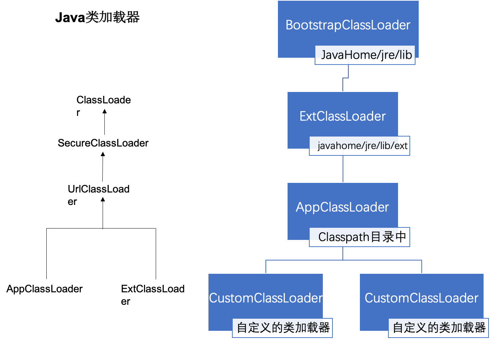

##java基础
### 基础数据类型与大小
* byte(8bit) 一个字节 8个二进制位 内存的最小单位 bit  1kb = 1024bit
* char(16bit)
* boolean(为了内存中对齐 8bit/32bit)
* short(16bit)
* int(32bit)
* long(64bit)
* float(32bit)
* double(64bit)

### 图片的像素 pxSize
* ARGB_8888 32bit
* ARGB_4444 16bit
* RGB_565   16bit
* ALPHA_8   8bit

BitMap在内存中的大小 width * height * pxSize
Android 资源解析 的时候会拉伸或压缩图片资源比如：
资源在hpdi 目录，设备为xxhdpi 加载时会将图片拉伸为 targetDpi/resDpi倍

### 数据结构集合框架实现原理
* List	  可包含重复元素
	*     ArrayList：底层实现是数组，默认容量是10，每次达到上限后会扩容 oldCapcity + oldCapcity >>1 (约为1.5)。将会创建新的数组将原有数组中的数据copy到新数组中，Arrays.copyOf. Systerm.copyArray。扩容过程有内存峰值，尽量避免。
	*     LinkedList：用链表数据结构，来实现的list 增删操作平繁的要选LinkedList，ArrayList查询效率更高O(1)
* Set.   不可包含重复元素
	*     HashSet 实现原理 在 HashMap 的key上保存数据，value上保存一个空对象，具体参见HashMap
	*     TreeSet 实现原理 在 TreeSet 的key上保存数据，value上保存一个空对象，具体参见TreeSet
* Map
	*     HashMap 数组➕链表（1.8 + 红黑树）
	*     TreeMap
### HashMap
* 实现原理：
hash表+链表+红黑树。hash表初始长度16，扩容因子0.75(柏松分布，减少碰撞与空间利用的平衡点). 每次扩容X2。所以哈希表的容量总是2的n次方
* hash表的实现 ：key 的hashCode高位与地位抑或得hash值（使高位已参与进来，减少碰撞），key在hash表中的位置 i = hash&（容量-1）。
* 链表与红黑树的转换：
Node->TreeNode 8, TreeNode ->Node 6,不相同的目的在于防止过多的转换。与链表相比红黑树查找更快，当占据内存更大。更多的情况是，hash冲突的个数<7,此时链表的查询效率也可以接受， 为了节省空间选择链表>7时,链表效率下降明显，改用树（64）。
* 扩容 resize：什么时候扩容？空桶数量不足25%时。

### ConcurrentHashMap
Java1.7 Segment数组+HashEntry数组。Segment继承了ReentrantLock，自带锁。
Java1.8 Synchronized + CAS + Node + Unsafe

##Object类 万物之源
###方法
#### getClass
获取当前对象的字节码
#### hashCode
返回对象的哈希代码值。支持此方法的好处是散列表
#### toString
	 public String toString() {
       	 return getClass().getName() + "@" + Integer.toHexString(hashCode());
    }

#### wait
***native方法：***使当前线程等待直到另一个线程调用此对象Object.notify（）或Object.notifyAll（）方法，或其他某个线程中断当前线程，或等待时间已结束。
#### notify
***native方法：*** 唤醒等待此对象监视器的单个线程。如果有任何线程正在等待这个对象，则选择其中一个线程被唤醒。选择是任意的，由实现者自行决定。线程通过调用{@code wait}方法之一来等待对象的监视器
#### notifyAll
*native方法* 清除此对象监视器上等待的所有线程。线程通过调用{@code wait}方法之一来等待对象的监视器
#### equals

 	public boolean equals(Object obj) {
        	return (this == obj);
    	}
#### finalize
对象回收时回调用

#### equals与==的区别

**==**的作用是判断两个对象的地址是不是相等，即判断两个对象是不是同一个对象，(基本数据类型==比较的是值，引用数据类型==比较的是内存地址) equals要看具体实现。 Object equals和==是相同的。
##虚拟机原理

### JVM内存模型 
高速缓存区的存在，为了保证缓存一致。
* 线程共享主存 
* 工作内存

###JVM 内存分区
1. 堆(heap) 存放对象实例 根据对象的生命周期分代管理，便于GC。
2. 方法区 类** 永久代** 加载的类的信息，常量，静态变量，JIT后的代码。
线程私有 生命周期与线程同步
3. VM Stack  单元结构为栈帧 存储局部变量表，操作栈数，动态链接，方法出口
4. Native Method Stack 存储native方法的信息
5. 程序计数器 线程执行字节码的行号指示器。
直接内存 使用NIO可直接读写

###GC机制
### 标记算法：
1. 	引用计数法： 引用数为0时，则可回收，对于互相调用的情况，会出现计数永不为0。
2. 	根搜索法： GC Roots 不可达时则可回收。
#### GC Roots
    a.VM Stack中引用的对象
    b.Native method Stack中的引用对象
    c.方法区中的静态属性引用的对象
    d.方法区中的常量对象
    GC Root不可达的对象将会被标记回收
    
*     a.标记-清除算法，占用空间小，效率低，产生内存碎片
*     b.复制算法，简单高效，但需要等量内存担保，得到连续的内存，存活对象变多时，效率会下降
*     c.标记整理算法， 先标记除要回收的对象，然后将存活对象向一端靠拢，然后清理端边界以外的内存
*     d.（堆内存回收）分代回收算法，根据存活对象的生命周期长短将内存分为几块区域，JVM堆内存分为 新生代和老年代 **新生代**采用复制算法，**老年代**使用标记整理算法。

HotSpot 虚拟机采用分代回收算法：
老年代：新生代（Eden ：Surviver （ From：To = 1:1）=8 ：2） = 2 ：1
### 方法区的回收：
    废弃的常量，常量的引用不存在时会被回收。
    无用的类，类的实例不存在，类的字节码没有被引用，类的加载器已被回收。
    
### 引用类型与使用场景

* a.强引用 直接指向实例对象的引用。 引用存在就不可被回收。
* b.软引用 指向SoftReference包裹对象的引用，但内存溢出之前，GC回收软引用. 可做内存缓存，如图片缓存，充分利用内存的同时防止内存溢出。
* c.弱引用 指向WeakReference包裹对象的引用，下一次GC到来时会被回收，不论是否面临内存溢出， 在静态内部类中，经常会使用弱引用防止内存泄露。
* d.虚引用 指向PhantomReference包裹对象的引用，获取不到对象实例

###类加载机制
**类加载过程**

加载 -- 验证 -- 准备 -- 解析 -- 初始化 -- 使用 --卸载

加载时机：

1. new 创建对象或调用类的静态成员时
2. 通过反射调用
3. 子类初始化时会先加载父类
4. main方法所使用到的类
5. 动态语言使用

**双亲委派机制**
1.类加载过程
2.加载时间
3.双亲委派机制

	
静态变量属于类变量，像这样public static int a = 1  的语句执行在类加载时时执行。类加载只有一次，必然之执行一次。

##并发
指令重排序：JVM 为了优化程序执行过程。编译时改变指令的执行顺序。

线程的实现：java线程是通过系统线程实现的。

线程的调度

1. 协同式线程调度  kotlin的协程
2. 抢占式线程调度（java线程调度方式）

状态转换

线程安全

锁优化

主内存 到 工作内存，对象创建以后保存在堆内存中。当有子线程调用对象时，是会先将主内存的值复制一份到工作内存中，使用完成后会写回的主内存中去。

####1.线程
1. 线程的状态
	1. NEW :创建 new 
	2. RUNNABLE：可运行，调用start之后
	3. BLOCKED：阻塞，等待获取锁
	4. WAITING：await yeild 等方法自己不会自动变回runnable状态
	5. TIMED_WAITING：定时等待 时间到了自动变回runnable状态
	6. TERMINATED：结束 run方法执行完成或者异常退出
	
	
2. Java线程创建的几种方式
	* 继承Thread类
	* 实现Runnable接口
	* Callable 返回Future对象
	* 使用线程池创建()管理调度线程
3. 线程相关的一些方法:
	Obj 的方法 wait() 与 notify()	notifyAll()  wait(timeout) 自动唤醒
	 wait 同步方法中调用，调用对象锁住的对象 
	 notify 
	sleep（timeout）不会释放锁，wait（timeout）会释放锁。

####2.线程池
线程池的状态

 *   RUNNING:  接受新任务并处理排队的任务
 *   SHUTDOWN: 不接受新任务，但处理排队的任务
 *   STOP: 不接受新任务，不处理排队的任务，中断正在进行的任务
 *   TIDYING:  所有任务都已终止，workerCount为零，转换为TIDYING状态的线程将运行terminated（）钩子方法
 *   TERMINATED: terminated()以执行完毕。
 
 线程池的核心参数及意义
 
	字段 |意义|
	---------|--------|
	int corePoolSize|核心线程数，保留工作线程的最小数量，核心线程不会timeout除非设置allowCoreThreadTimeOut =true|
	int maximumPoolSize|最大线程数 不能超过CAPACITY|
	long keepAliveTime TimeUnit unit|当存活的线程数大于corePoolSize时，闲置线程多少时间后被销毁|
	BlockingQueue workQueue|用来存放execute()方法提交的Runnable任务|
	ThreadFactory threadFactory|创建线程的工厂对象|
	RejectedExecutionHandler handler|用来处理当线程数和队列数超上限时的策略|
 
 
 	常用的BlockingQueue |意义|
	---------|--------|
	SynchronousQueue|一个不存储元素的阻塞队列  CachedThreadPool|
	LinkedBlockingQueue|可设置容量队列）基于链表结构的阻塞队列，按FIFO排序任务|
	ArrayBlockingQueue|数组实现的有界阻塞队列|
	DelayQueue |延迟队列）是一个任务定时周期的延迟执行的队列。根据指定的执行时间从小到大排序|
	PriorityBlockingQueue |具有优先级的无界阻塞队列|

Executors.newSingleThreadExecutor();// 核心线程数和最大线程数都为1 LinkedBlockingQueue
Executors.newFixedThreadPool(mThreadCount); //固定只有mThreadCount核心线程 。LinkedBlockingQueue
Executors.newCachedThreadPool(); // 无核心线程，可以无限创建工作线程，线程保活60s，SynchronousQueue
Executors.newScheduledThreadPool(coreThreadCount); // 可做周期性，延时任务。线程保活10ms DelayedWorkQueue

**submit 和 excute 方法的区别：**都是提交任务 submit会将提交的Runnable 包装成FutureTask 来执行 返回Future 我们可以通过Future。get()得到执行完成的结果。excute返回void 。
  

### 3.锁
1. 公平锁/非公平锁：公平锁是多线程模式下按照申请顺序来获取锁,排队获取锁。非公平锁但锁处于处竞争状态
2. 乐观锁/悲观锁：悲观锁在多线程并发模式下一定会出现线程安全问题,

### volatile synchronized Lock

#### volatile ：
* 防止指令重排：修饰符修饰成员变量，被修饰的变量在被操作时，通过提供“内存屏障”的方式来防止被虚拟机指令重排序；
* 可见性：线程修改volatile变量时会强制将修改后的值刷新的主内存，其他现程在读取变量时，会重新读区最新的值。
* volatile并不保证变量更新的原子性，比如：i++ 这样的非原子运算操作
* 轻量级的锁机制，屏蔽了虚拟机对指令的优化，有一定的性能损耗，不可滥用。
volatile 变量在编译后，在执行写操作前会发出Lock指令，发出的LOCK#指令锁总线（或锁缓存行），同时让Thread-B高速缓存中的缓存行内容失效

#### synchronized：

对于synchronized修饰的方法编译后的字节码会加上ACC_SYNCHRONIZED标记，
当synchronized同步代码块则是在代码块前插入monitorenter ，结束的位置插入monitorexit。每一个对象有且仅有一个与之对应的monitor（监视器）对象，当线程

### 互斥性、可见性、顺序性

### 对象锁与类锁的区别
* 修饰**实例的方法**：锁住的是当前的实例，当前实例的中所有被Synchronized的方法只能被持有锁的单一线程执行，其他线程只能等待锁被释放后再去获取锁。
* 修饰**静态方法**：锁住的是当前类的字节码
* 修饰**代码块**：需要传入锁对象，可以是对象实例也可以是类的字节码对象。

### 死锁
是在多线程模式下，线程直接一种循环等待状态
四个必要条件：

* 1.互斥：同一时间资源只能被一个线程使用。
* 2.占有并等待：线程占有一个资源并等待另一个资源。
* 3.资源不能抢占，只能等待执行完成，自动释放。
* 4.循环等待：有一组线程循环等待对方的资源。

### Lock
#### Lock 与 synchronized  对比。
1.Lock是一个接口，而synchronized是Java中的关键字，synchronized是内置的语言实现；
2.lock可以拿到获取锁的结果，synchronized并不会有任何反馈。
3. interrupt方法只能中断阻塞转台的线程，持有锁的线程无法interrupt，synchronized 线程阻塞状态不可中断
4.lock必须手动释放锁，synchronized会在执行完成，或异常后自动释放锁。

#### ReentrantLock 
ReentrantLock主要利用CAS+AQS队列来实现。它支持公平锁和非公平锁，两者的实现类似

## 设计模式
1.装饰器模式，跟 代理模式的区别。
代理模式：代理模式的定义：由于某些原因需要给某对象提供一个代理以控制对该对象的访问。这时，访问对象不适合或者不能直接引用目标对象，代理对象作为访问对象和目标对象之间的中介。代理是基于接口实现的。源码 Binder通信。
主要作用：保护目标类，适合于C/S 模式下使用，降低耦合性，增加拓展性。
缺点：增加了类的数量，性能有一定损耗。

装饰器模式：在不修改原先对象核心的功能的情况下，对功能进行增强, 属于对象结构型模式。实现是基于继承的。
源码示例：Java.io  BufferedInputStream/BufferedOutputStream

外观模式：为子系统中的一组接口提供一个一致的界面，外观模式定义了一个高层接口，这个接口使得这一子系统更加容易使用（Android Context）

模版设计模式：Android组件 activity service 等。

### 设计模式分为三大类：
*  创建型模式
	*  工厂方法模式 
	*  抽象工厂模式
	*  单例模式		
	*  建造者模式	Okhttp Request/Response
	*  原型模式     
*  结构型模式
	*  适配器模式    ListView/ RecyclerView
	*  装饰器模式   	Java.io  BufferedInputStream/BufferedOutputStream
	*  代理模式	   静态代理/动态代理 ->Retrofit
	*  外观模式		Android Context
	*  桥接模式		adb/js bridge
	*  组合模式		Compose
	*  享元模式		int/message pool
*  行为型模式
	*  策略模式		
	*  模板方法模式	Activity/Service
	*  观察者模式	事件监听，广播，EventBus
	*  迭代子模式	数据集合
	*  责任链模式    Okhttp 的拦截器
	*  命令模式		
	*  备忘录模式
	*  状态模式
	*  访问者模式
	*  中介者模式
	*  解释器模式

