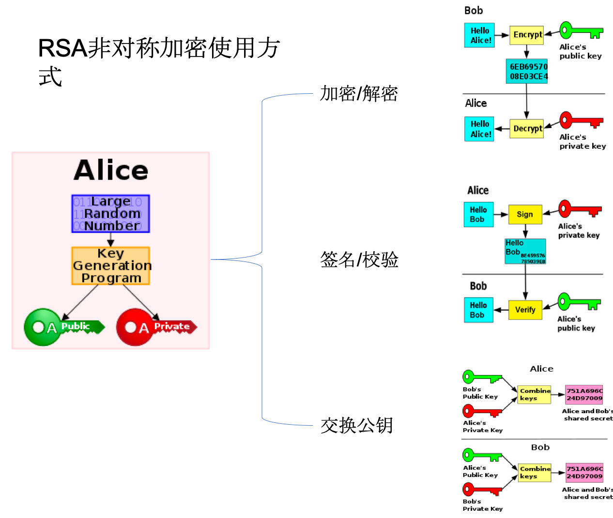

## Rxjava 解析
### Base classes 
* **Observable**   	0..N flows, no backpressure,
* **Flowable**  		0..N flows, supporting Reactive-Streams and backpressure
* **Single** 		a flow of exactly 1 item or an error
* **Completable** 	a flow without items but only a completion or error signal
* **Maybe** 		a flow with no items, exactly one item or an error.


### 相关概念（terminology）
* **upstream，downstream**
数据的流式操作，针对当前操作前面为upstream，后续为downstream
* **Objects in motion**
在RXJava的文档中，emission, emits, item, event, signal, data and message 被认为是同义词，并代表沿着数据流行进的对象。
* **Backpressure**
当数据流通过异步运行时，每个步骤可以以不同的速度执行不同的操作。为了避免压倒性的这些步骤，这些步骤通常表现为由于临时缓冲或需要跳过/删除数据而增加的内存使用量，
应用所谓的背压，这是一种流量控制的形式，其中这些步骤可以表示它们准备处理多少个项目。这允许在数据流的内存使用限制的情况下，通常没有方法知道上游将发送多少项
在RxJava，专用的Flowable类被指定为支持背压，并且Observable专用于不支持背压（短序列、GUI交互等）。 Single, Maybe 和 Completable不支也持不应该背压，他们总是有空间暂时存储一个项目。
* **Assembly time 组装阶段**
通过应用各种中间运算符制备数据流发生在所谓的组装时间
* **Subscription time 订阅阶段**
当在内部建立一系列处理步骤的流程上调用subscribe()时，这是一个临时状态：
* **Runtime 运行阶段**
这是当流主动发射项目、错误或完成信号时的状态：

### Schedulers
RxJava操作符不直接使用线程或ExtutoServices，而是用所谓的调度器抽象出统一API背后的并发源。RXJava 2具有几个通过Schedulers工具类访问的标准调度器。

API 	| 使用场合
-------|-----------
Schedulers.computation() | 在后台固定数量的专用线程上运行计算密集型工作。大多数异步运算符将此作为默认Scheduler。
Schedulers.io() | 在动态改变的线程集上运行I/O类或阻塞操作。
Schedulers.single() | 以顺序和FIFO方式在单个线程上运行工作。
Schedulers.trampoline() | 在一个参与线程中以顺序和FIFO方式运行工作，通常用于测试目的。
### 实现原理
1. 组装阶段
    Observable ---optionc--- Observable 通过操作创建新的Observable并将上一个Observable作为 source
2. 订阅阶段
   最后的Observable 调用 subscribe（Observer）--> 实际调用 subscribeActual 创建新的Observer传入(原Observer作为downStream) 由source.subscribe(Observer)
3. 执行阶段
   源头开始执行，触发观察者。
   
  没有线程调度器 
   
  有线程调度器 
   

## EventBus 解析

### 使用
1. 定义事件类。

	```
	public static class MessageEvent { /* Additional fields if needed */ }
	```
2. 实现订阅的方法，并在相应的类注册在EventBus

	```
	@Subscribe(threadMode = ThreadMode.MAIN)  
	public void onMessageEvent(MessageEvent event) {/* Do something */};
	
	
	 @Override
	 public void onStart() {
	     super.onStart();
	     EventBus.getDefault().register(this);
	 }
	
	 @Override
	 public void onStop() {
	     super.onStop();
	     EventBus.getDefault().unregister(this);
	 }
	``` 
3. 发送消息

	```
	EventBus.getDefault().post(new MessageEvent());
	```

### 源码分析

1. 订阅者的注册     

	EventBus.getDefault().register(this);
	通过反射的方法找到被@Subscribe标柱的方法，缓存下次注册直接去缓存。将Subscription(subscriber, subscriberMethod)按订阅事件的类型进行存储，按优先级排序。
	将订阅事件类型按订阅对象分类存储
	对于sticky订阅方法
	
	
	
## #Http
> http是一个简单的请求-响应协议，它通常运行在TCP之上的应用层协议。
>
> 报文格式：
>>	请求头(Method  url  http[version] ) － request header － request body
>>
>>	响应头(http[version]  stateCode msg) － respose header －respose body

### 1.UDP 与 TCP 
UDP 无连接 无状态 高效 不安全(不保证数据一定传达)
TCP 有链接 有状态 安全（确保数据包不会丢失）建立连接 三次握手 断开连接四次挥手。
SSL/TLS  拿到应用层传递的内容用对其进行 对称加密AES  签名 ， 密钥 用 非对称加密RSA    服务端先用私钥解密 对称加密的密钥然和解密内容 传递给应用层
### 2.Http 1.1 / SPDY / Http 2.0对比

Http 1.1 ：串行请求

SPDY：
规定通信中使用 SSL（强制Https）， SPDY 以会话层的形式加入，控制对数据的流动，但还是采用 HTTP 建立通信连接。
 一次TCP连接，多次Http请求响应，优先级，头压缩，推送，服务器提示。
Http 2.0 ：支持IO 多路复用 并行请求 ，消息头的压缩算法采用 HPACK  服务端推送（Server Push）对客户端的一个请求发送多个相应。
###  3.Https
超文本传输安全协议（Hypertext Transfer Protocol Secure），1994年由网景公司提出，Https经由Http进行通信，但利用SSL/TLS来加密数据，即在Http协议与TCP协议之间添加SSL/TLS层。
### 下载断点续传
1. 分段请求：参数Range： bytes=[startIndex]-[endIndex]
2. 响应码206 
3. 文件RandomAccessFile随机访问文件。seek()到指定位置开时写入。

### RSA

## OkHttp 解析
### 责任链模式
> Intercepter 观察、修改和潜在的短路请求发出和相应的响应返回。通常拦截器在请求或响应上添加、删除或转换标头。

```
interface Interceptor {
  	fun intercept(chain: Chain): Response

	interface Chain {
		...
		fun request(): Request
		fun proceed(request: Request): Response
		fun connection(): Connection?
	    	...
	}
}
```
Interceptor的内部接口Chain 的proceed方法接受一个Request返回Response，构成责任链的基础。RealInterceptorChain 实现了Chain接口。所有Interceptor都是连接在RealInterceptorChain的基础上的。

 ```
 val chain = RealInterceptorChain(interceptors, transmitter, null, 0, originalRequest, this,
        client.connectTimeoutMillis, client.readTimeoutMillis, client.writeTimeoutMillis)
 val response = chain.proceed(originalRequest)
 
 
 ```
#### RealInterceptorChain
> 一个具体的拦截器链，承载整个拦截器链：所有应用程序拦截器、OkHttp核心、所有网络拦截器，最后是网络调用者。index 参数代表拦截器的在责任链中的位置，其 proceed（）中每一个Interceptor都会重新创建一个RealInterceptorChain，给当前的Interceptor的intercept（next）调用。返回拦截后的Response，所以关键的逻辑都在拦截器的intercept 方法中实现。

 ```
 override fun proceed(request: Request): Response {
    return proceed(request, transmitter, exchange)
  }
fun proceed(request: Request, transmitter: Transmitter, exchange: Exchange?): Response {
    ...
    val next = RealInterceptorChain(interceptors, transmitter, exchange,
        index + 1, request, call, connectTimeout, readTimeout, writeTimeout)
    val interceptor = interceptors[index]
    val response = interceptor.intercept(next) 
    ...
    return response
  }
 ```

接下来看看OkHttp内部的五个拦截器的实现：
#### RetryAndFollowUpInterceptor
> 此拦截器将从故障中恢复，并根据需要执行重定向。如果调用被取消，它可能会抛出[IOException]。看看intercept内部逻辑。

 ```
   override fun intercept(chain: Interceptor.Chain): Response {
    ...
    while (true) {
      ...
      var success = false
      try {
        response = realChain.proceed(request, transmitter, null)
        success = true
      } catch (e: RouteException) {
        // The attempt to connect via a route failed. The request will not have been sent.
        if (!recover(e.lastConnectException, transmitter, false, request)) {
          throw e.firstConnectException
        }
        continue
      } catch (e: IOException) {
        // An attempt to communicate with a server failed. The request may have been sent.
        val requestSendStarted = e !is ConnectionShutdownException
        if (!recover(e, transmitter, requestSendStarted, request)) throw e
        continue
      } finally {
        // The network call threw an exception. Release any resources.
        if (!success) {
          transmitter.exchangeDoneDueToException()
        }
      }

      // Attach the prior response if it exists. Such responses never have a body.
      if (priorResponse != null) {
        response = response.newBuilder()
            .priorResponse(priorResponse.newBuilder()
                .body(null)
                .build())
            .build()
      }

      val exchange = response.exchange
      val route = exchange?.connection()?.route()
      val followUp = followUpRequest(response, route)

      if (followUp == null) {
        if (exchange != null && exchange.isDuplex) {
          transmitter.timeoutEarlyExit()
        }
        return response
      }

      val followUpBody = followUp.body
      if (followUpBody != null && followUpBody.isOneShot()) {
        return response
      }

      response.body?.closeQuietly()
      if (transmitter.hasExchange()) {
        exchange?.detachWithViolence()
      }

      if (++followUpCount > MAX_FOLLOW_UPS) {
        throw ProtocolException("Too many follow-up requests: $followUpCount")
      }

      request = followUp
      priorResponse = response
    }
  }

 ```
内部有个死循环来重定向知道达到最大次数或者没有重定向时跳出循环，先尝试发起请求，try catch 去捕获过程中抛出的异常，在route fail 和server fail 尝试recover 。

#### BridgeInterceptor
> 从应用程序代码到网络代码的桥梁。首先，它从用户请求构建一个网络请求。然后它继续呼叫网络。最后根据网络响应构建用户响应。构造函数中传入CookieJar来构建和管理Cookie。

#### CacheInterceptor
提供来自缓存的请求，并将响应写入缓存。先查一下缓存，如果有缓存可用，就用缓存，没有就发请求，在将response 更新缓存。缓存Cache的实现用到了DiskLruCache。将HTTP和HTTPS响应缓存到文件系统，以便可以重用它们，从而节省时间和带宽。为了度量缓存的有效性，此类跟踪三个统计信息：

* [请求计数：][requestCount]**自创建此缓存以来发出的HTTP请求数。
* [网络计数：][networkCount]**需要网络使用的请求数。
* [命中计数：][hitCount]**缓存为其响应提供服务的请求数。

有时请求会导致条件缓存命中。如果缓存包含响应的过时副本，客户端将发出条件“GET”。然后，服务器将发送更新的响应（如果已更改），
或者发送简短的“未修改”响应（如果客户端的副本仍然有效）。这样的响应增加了网络数量和命中率
提高缓存命中率的最佳方法是配置web服务器以返回可缓存的响应。尽管这个客户机接受所有的[HTTP/1.1（rfc7234）][RFC_7234]缓存头，但它不缓存部分响应。
在某些情况下，例如用户单击“刷新”按钮后，可能需要跳过缓存，直接从服务器获取数据。若要强制完全刷新，请添加“no cache”指令。
缓存在发起请求的时候是可配置的

#### ConnectInterceptor
打开到目标服务器的连接并继续到下一个拦截器，获取链接的代码
ConnectionPool 管理HTTP和HTTP/2连接的重用，以减少网络延迟。共享同一[Address = host + port]的HTTP请求可以共享一个[Connection]。
此类实现要保持打开的连接以备将来使用的策略。创建一个新的连接池，使用适合单个用户应用程序的调整参数。
此池中的调优参数可能会在将来的OkHttp版本中更改。目前，此池最多可容纳5个空闲连接，这些连接将在5分钟不活动后退出。
RealConnection 真正的连接包括 TCP 以及TLS/SSL

* 判断当前的连接是否可以使用：流是否已经被关闭，并且已经被限制创建新的流；
* 如果当前的连接无法使用，就从连接池中获取一个连接；
* 连接池中也没有发现可用的连接，创建一个新的连接，并进行握手，然后将其放到连接池中。


#### CallServerInterceptor
这是链上最后一个拦截器。它对服务器进行网络调用，
 
```
	exchange.writeRequestHeaders(request). // 请求头 信息
	exchange.createRequestBody().writeTo(bufferedRequestBody) // 请求体 信息

	exchange.readResponseHeaders(). // 读取响应头 信息
	exchange.openResponseBody(response) // 代开响应体 信息`
```
Exchange 传输单个HTTP请求和响应对。这会在上分层 管理 连接和 ExchangeCodec事件（处理实际的I/O）
## Retrofit 解析

### 使用
1. 定义Service接口，对Api接口方法进行注解标注：

```
	 public interface Api {
	    @GET("users/{user}/repos")
	    Call<List<String>> listRepos(@Path("user") String user);
	}
```
2.使用Builder模式构建Retrofit实例：

```
	Retrofit retrofit = new Retrofit.Builder()
                .baseUrl("https://api.github.com/")
                .build();
```
  
3.使用retrofit实例的create方法，创建代理对象，然后就可以通过代理对象发起网络请求：

```
    Api service = retrofit.create(Api.class);
    service.listRepos("octocat");
```

拦截器分析完毕，看看同步和异步请求：
### RealCall
Transmitter  OkHttp的应用程序和网络层之间的桥梁。此类公开高级应用程序层原语：连接、请求、响应和流。此类支持[异步取消][取消]。
这是为了使半径尽可能小。如果HTTP/2流是活动的，取消将取消该流，但不会取消共享其连接的其他流。但如果TLS握手仍在进行中，那么取消可能会中断整个连接

### 源码分析
####1. Retrofit对象的创建。
使用建造者模式，

* 可以添加client作为发起网络访问的客户端。
* addCallAdapterFactory 可以和RxJava等连用
* callbackExecutor 配置线程池全局统一管理调度线程
* addConverterFactory 对结果进行转换

####2. 代理对象的创建
**retrofit.create**方法使用动态代理的方式创建service，其中method便是我们接口定义的方法

```
	public <T> T create(final Class<T> service) {
	    validateServiceInterface(service);
	    return (T) Proxy.newProxyInstance(service.getClassLoader(), new Class<?>[] { service },
	        new InvocationHandler() {
	          private final Platform platform = Platform.get();
	          private final Object[] emptyArgs = new Object[0];
	          @Override public @Nullable Object invoke(Object proxy, Method method,
	              @Nullable Object[] args) throws Throwable {
	            // If the method is a method from Object then defer to normal invocation.
	          ...
	            return loadServiceMethod(method).invoke(args != null ? args : emptyArgs);
	          }
	        });
	  }
```
**ServiceMethod对象的获取** 

1. retrofit.loadServiceMethod(method) 
2. ServiceMethod.parseAnnotations(retrofit, method) // ServiceMethod 抽象类HttpServiceMethod为子类
3. requestFactory = RequestFactory.parseAnnotations(retrofit, method) // 获取请求的工厂对象
3. HttpServiceMethod.parseAnnotations(retrofit, method, requestFactory)
	* 	1. 传建callFactory = retrofit.callFactory 
	* 	2. 创建responseConverter = createResponseConverter(retrofit, method, responseType)
			*  retrofit.callAdapter(returnType, annotations)
	* 	3. 创建callAdapter = createCallAdapter(retrofit, method, adapterType, annotations);
	* 	4. CallAdapted<>(requestFactory, callFactory, responseConverter, callAdapter)
	
```
	Object (java.lang) 
		ServiceMethod (retrofit2) A
			HttpServiceMethod (retrofit2) A
				CallAdapted in HttpServiceMethod (retrofit2) 
				SuspendForResponse in HttpServiceMethod (retrofit2)
				SuspendForBody in HttpServiceMethod (retrofit2)
```

**ServiceMethod.invok();**
	
	# HttpServiceMethod
	invok (Object[] args) {
		Call<ResponseT> call = new OkHttpCall<>(requestFactory, args, callFactory, responseConverter);
		return adapt(call, args);
	}
	
	# CallAdapted
	@Override protected ReturnT adapt(Call<ResponseT> call, Object[] args) {
   		 return callAdapter.adapt(call);
    }
	

####3. 从中学到什么？
对于复杂的对象创建使用builder模式，

1. 实例化过程的有序性，保证对象构建过程安全。
2. 对象默认值，降低了使用难度，
3. 第三可配。置性是对象的构建更灵活。

使用动态代理来模式来实现代码隔离，接口定义对外调用的方法，通过动态代理实现具体功能，外部调用时看不到实现过程，起到了很好的隔离作用。

面向接口编程，增强了拓展性，降低了模块之间的耦合性。

对于有可能频繁去创建的对象，缓存池化管理，降低内存CPU的开销。


##Glide 
Glide 是一个快速高效的Android图片加载库，注重于平滑的滚动。
Glide 提供了易用的API，高性能、可扩展的图片解码管道（decode pipeline），以及自动的资源池技术。
Glide 支持拉取，解码和展示视频快照，图片，和GIF动画。Glide的Api是如此的灵活，开发者甚至可以插入和替换成自己喜爱的任何网络栈。默认情况下，Glide使用的是一个定制化的基于HttpUrlConnection的栈，但同时也提供了与Google Volley和Square OkHttp快速集成的工具库。

虽然Glide 的主要目标是让任何形式的图片列表的滚动尽可能地变得更快、更平滑，但实际上，Glide几乎能满足你对远程图片的拉取/缩放/显示的一切需求。
图片加载过程   求网络   解码   缓存   展示

### Glide里的缓存
默认情况下，Glide 会在开始一个新的图片请求之前检查以下多级的缓存：

1. 活动资源 (Active Resources) - 现在是否有另一个 View 正在展示这张图片？
1. 内存缓存 (Memory cache) - 该图片是否最近被加载过并仍存在于内存中？
1. 资源类型（Resource） - 该图片是否之前曾被解码、转换并写入过磁盘缓存？
1. 数据来源 (Data) - 构建这个图片的资源是否之前曾被写入过文件缓存？

前两步检查图片是否在内存中，如果是则直接返回图片。后两步则检查图片是否在磁盘上，以便快速但异步地返回图片。如果四个步骤都未能找到图片，则Glide会返回到原始资源以取回数据（原始文件，Uri, Url等）。
关于 Glide 缓存的默认大小与它们在磁盘上的位置的更多细节，或如何配置这些参数，请查看 配置 页面。

### Bitmap 池
Glide 使用 LruBitmapPool 作为默认的 BitmapPool 。LruBitmapPool 是一个内存中的固定大小的 BitmapPool，使用 LRU 算法清理。默认大小基于设备的分辨率和密度，同时也考虑内存类和 isLowRamDevice 的返回值。具体的计算通过 Glide 的 MemorySizeCalculator 来完成，与 Glide 的 MemoryCache 的大小检测方法相似。

### 各级缓存的实现原理：
内存缓存分为两级 ，Engine先通过loadFromActiveResources 方法获取活跃资源缓存，ActiveResource使用HashMap缓存 EngineResource的弱引用。如果有则返回没有再调用 loadFromCache 来获取内存缓存，内存缓存实现者LruResourceCache 继承自 LruCache（有LinkedHashMap + Lru算法实现）。获取内存缓存时调用的remove方法，取出后进入ActiveResource中缓存，以保证内存中同时只存在一份。资源不在Active的时候通过deactivate 方法从activeResource中移除，缓存至内存缓存中。（前题是配置允许内存缓存）
当内存缓存中获取不到时，则需要异步加载。

调用 waitForExistingOrStartNewJob 开始查找磁盘缓存， 首先在jobs（保存正在执行的Job）中查找，又有者将其封装成LoadStatus返回，LoadStatus可以通过cancel方法取消对当前Job的监听，不在关注加载结果，但job的全部cbs 中的CallBack全部被移除时，job也就会被释放。如果job不存在则new一个EngineJob 和 DecodeJob 并且EngineJob 然后返回LoadStatus。

Job start 会根据job的参数选择具体executor  根据Job的Stage 来判断如果已经是RESOURCE_CACHE｜DATA_CACHE 阶段直接叫个diskCacheExecutor执行DecodeJob。否则根据Glide配置useUnlimitedSourceGeneratorPool 觉得是否用sourceUnlimitedExecutor 再根据useAnimationPool决定是否用animationExecutor 都不需要则用sourceExecutor执行DecodeJob。

DecodeJob执行过程：DJ实现了Runner是个线程，
一个DecodeJo的完整阶段如下，但也可以通过不同的
初始阶段 (INITIALIZE)
从缓存资源解码(RESOURCE_CACHE) 资源缓存中解码
从缓存的源数据解码（DATA_CACHE）元数据缓存中解码
从检索到的源解码（SOURCE）
成功加载后对转换的资源进行编码（ENCODE ）
没有更多可行的阶段（FINISHED）

从run方法开始： 

1. 初始化 DataFetcher 
2. 判断任务是取消如果取消，通知加载失败，return；否则runWrapped
3. runWrapped根据RunReason 来执行：
	* 	INITIALIZE  第一次提交。 先确定下一个状态
	*  	SWITCH_TO_SOURCE_SERVICE 我们需要从磁盘缓存切换到 资源
	*    DECODE_DATA


四个GlideExecutor 的区别：

* diskCacheExecutor  最大线程数1 ，用来执行解码磁盘缓存的线程池
* sourceUnlimitedExecutor 核心线程数0 工作线程数无限大 存活10s
* animationExecutor 执行动画的线程 cpu数超过4时是两个线程否则只有一个线程。
* sourceExecutor 允许网络来管理线程池 默认线程数 min（4， cpu数）

计算最佳线程数：自动计算时最多分配四个线程  最多可用线程数通过cpu数量来确定
<!--Why？为什么有内存还要加个active 缓存呢 ？是为在不同场景下快速命中缓存。假设只有LruCache 在内存空间中是固定大小的。活跃状态下的资源加入到缓存中，每次使用查询效率低，-->

Glide的优点：
	1.生命周期敏感，
	2.资源的复用，Bitmap
	3.强大的缓存机制。
	4.丰富解码器应对不同的数据来源，本地文件，资源，包括gif，视屏封面等。
	5.API 灵活易拓展，可配置性高，链式调用使用简节方便。
	6.图片按需加载，列表的滚动过程中加在当前显示的优先加在。
	
	
## EventBus


## ARouter


## [LeakCanary](https://www.jianshu.com/p/59106802b62c)
是一款开源的内存泄漏检查工具，在项目中，可以使用它来检测Activity是否能够被GC及时回收。
LeakCanary实现内存泄漏的主要判断逻辑是这样的。当我们观察的Activity或者Fragment销毁时，我们会使用一个弱引用去包装当前销毁的Activity或者Fragment,并且将它与本地的一个ReferenceQueue队列关联。我们知道如果GC触发了，系统会将当前的引用对象存入队列中。
如果没有被回收，队列中则没有当前的引用对象。所以LeakCanary会去判断，ReferenceQueue是否有当前观察的Activity或者Fragment的引用对象，第一次判断如果不存在，就去手动触发一次GC，然后做第二次判断，如果还是不存在，则表明出现了内存泄漏。
activity引用的获取通过applic的registerActivityLifecycleCallback（），Fragment 通过FragmentManager.registerFragmentLifecycleCallbacks.


ARouter框架解决了什么问题，内部原理是怎样？
RxJava 的线程切换原理
RxJava用到哪些设计模式？
Retrofit 动态代理的理解
OkHttp 内部原理的理解
事件分发机制是怎样的？设计者为什么要设置拦截？
Android是如何通过View进行渲染的？
Android App 安装的流程是怎样的？
Android事件分发流程是怎样的？
Android插件化原理知道吗？
Android 组件化管理模式是怎样？
Android 使用Hook去拦截过系统源码吗？


网络框架对比和源码分析
自己去设计网络请求框架，怎么做？
网络请求缓存处理，okhttp如何处理网络缓存的
从网络加载一个10M 的图片，说下注意事项
TCP 的 3 次握手和四次挥手…
DNS解析过程
OKHttp框架是如何请求服务器的，说说你的看法
Http与Https两者的区别
说说应用层与传输层的关系
谈谈你对安卓签名的理解。
视频加密传输
